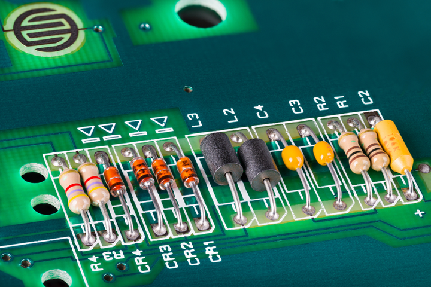

Since components are essentialy what make a circuit, it's extremely important to choose your components carefully, to ensure your circuit is to work according to what it aims. After selecting these components, the choice of your components and their peripheral information should be carefully documented in a BOM for your PCB manufacturing and assembly process to begin.

## Passive Components

Passive components are components that influence the flow of electricity running through them. They store energy and produce inductance, but don't necessarily amplify or control the signals themselves.

Passive components in circuits are commonly used to store and dissipate energy. They are also commonly used as transducers, which are responsible to convert electrical energy into another type of energy, or vice versa. Passive components are the main components that affect [Impedance](/articles/Impedance/), especially resistors, capacitors, and inductors, each of which has two other parasitic impedances besides intrinsic impedance.

### Resistors

Resistors are one of the basic electrical components. For PCBs, they are provided in 2 types: **lead resistors**, which are used for THT wave soldering, and **chip resistors**, which are suitable for SMT reflow soldering.

In lower frequencies, resistors contribute to the circuit's resistance only.

In higher frequencies, resistors will also contribute to the circuit's impedance through parasitic capacitance. In the region of these high frequencies, the total impedance will decrease, but the resistor will act as a capacitor.

When the operating frequency is higher, the resistor will alter, and act as an inductor -- i.e., contributing to the circuit inductance, and hence increasing the general circuit impedance.

### Capacitors

Commonly in PCBs, there are 2 types of capacitors used, based on their material: **film and electrolytic capacitors**. The two are used for different applications since they have different material characteristics.

|             | Film                        | Electrolytic                         |
| ----------- | --------------------------- | ------------------------------------ |
| Lifetime    | Several decades             | Short life span                      |
| Capacitance | Small                       | Relatively large, for large voltages |
| Size        | Larger                      | Smaller                              |
| Polarity    | No Polarity                 | Has a cathode and anode              |
| Tolerance   | ±10% or even less than ±0.5 | ±20%                                 |

The basic working principle of a capacitor is to store energy, so it can be used as an energy storage unit, but the amount of energy stored is directly related to the size of the capacitor. Generally, leaded tantalum capacitors with high capacitance for THT assemblies are used for this purpose.

Although capacitors are used to store energy, the simplified equivalent circuit of a capacitor is a series connection of a resistor and an inductor. Hence, the capacitor has inductive reactance and will appear inductive on a certain frequency value.

### Inductors

Inductors, like capacitors, are components that store energy. However, unlike capacitors which store energy in electric charges, inductors store transient energy as magnetic fields.

As the stacks and coils of inductors are similar to having multiple capacitors in series, inductors also have capacitance.

The frequency characteristics of an inductor is represented in an inverted V shape. When operating in low frequencies, it shows an inductive characteristic. However, when the operating frequency is higher than the resonant frequency, it becomes capacitive, which then lowers the general impedance of the circuit.

## Active Components

Active components are electrical components with internal energy, which could generate, amplify or modify electrical signals. They are dependent on power sources to operate.

Active components are generally semiconductors, which include diodes, transistors, thyristors, integrated circuits, etc.

### Diodes

Diodes are 2-layered P and N ionized plates which conduct current only in one direction. There are a few commonly used diodes for PCB applications:

- Rectifier diode - used to convert AC signals into DC signals.

- Zener diode - used for voltage regulation.

- Schottky diode - used as rectifiers in high-frequency circuits.

- Transient voltage suppression (TVS) diode - used to protect circuits from voltage spikes.

- Varactor diode - functions as a variable capacitor (different internal capacitance with different backward voltages)

- Avalanche diode - used for RF and microwave generation.

- PIN diode - used as RF switch and also for detecting X-rays and gamma rays.

- Gunn diode - used for oscillators and microwave amplifiers.

- Laser diode - used in optical devices; such as CD, DVD, and Blu-ray recorders and players.

- Light Emitting Diode (LED) - used in displays, as indicators and for lighting.

- Photodiode - converts light signals into electrical signals.

- Tunnel diode - used as a very high-speed switch (in the nanosecond range).

Since a diode has polarity, where it only allows current to flow through from its anode to its cathode, it must be positioned correctly in a circuit to ensure it serves its function. When a diode's polarity is reversed, and it's constantly in reverse bias -- this could cause the diode to break down and damage the circuit.

To indicate the polarity, you should first **silkscreen print the diode schematic symbol between the 2 pads**. Another symbol, **a silkscreen thread should be added on the cathode side of the diode, to indicate the polarity.**

### Transistors

Transistors are the basis of many integrated circuits and are used for error detection, rectification, amplification, switching, voltage stabilization, signal modulation, logic operations, etc. in PCBs.

There are several types of transistors commonly used in circuit applications:

- BJT (Bipolar Junction Transistors)

- IGBT (Insulated-Gate Bipolar Transistor)

- JFET (Junction-Gate Field-Effect Transistor)

- MOSFET (Metal Oxide Semiconductor Field-Effect Transistor)

There are 2 main package types of transistors,

- TO series for THT soldering. This includes TO03, TO099, TO-263, TO214, etc.

- SOT series for SMD soldering. This includes SOT23-5, SOT223, etc.

During operation, transistors often heat up. Therefore, they require heat sinks for their thermal management. Different types of heat sinks: metal case with fins, thermal grease, or any specially designed heat sink will work

For SMDs (Surface Mount Devices), a large area of ​​copper should be laid in the body part, preferably connected to the GND plane, functioning as a thermal pad for heat dissipation. For THT components, it is generally possible to parallel several components on the same physical heat sink.

### Thyristors

Thyristors are 4 layered semiconductors with alternating P and N materials. They are commonly used to control the flow of current, acting as a conditional switch.

The alternating 4 P and N layers provide thyristors with 3 junctions, with alternating polarity. To enable the flow of current from the anode to the cathode or vice versa, the polarity of the middle junction must be triggered by a signal. The middle junction is also known as the gate of the thyristor.

Thyristors have 3 methods of operations.

- Forward blocking state

This occurs when the current is not flowing from the anode to the cathode, even though the potential difference between the two is positive. This is due to the low signal (or untriggered) gate channel.

- Reverse blocking state

This occurs when the thyristor 'blocks' the current flow since the potential difference is negative between the anode and the cathode.

- Forward conducting state

The state allows the flow of current from the thyristor's anode to its cathode, which only occurs when the gate channel has been triggered.

There are few most commonly used thyristors in PCBs:

- SCR (Silicon controlled rectifier)

SCR is also known as thyristor rectifier. The SCR is the basic structure of a thyristor, which has 3 channels: anode, cathode, and gate. When the gate receives enough signal, the SCR will become conductive and allow current flow in a direction.

- TRIAC (Triode for alternating current)

TRIAC provides control of both halves of the alternating current, hence power is used more efficiently. However, due to its non-symmetrical configuration, TRIACs are more commonly used in lower power applications, such as light dimmers, electric fan speed controls, and small motor controllers.

- DIAC (Diode for alternating current)

DIAC is used in series with the gate port of TRIAC, to ensure TRIAC is triggered evenly in both directions.

- SIDAC (Silicon diode for alternating current)

SIDAC has a higher power-handling capability and higher breakover voltage than DIACs, and are used also to control the trigger of TRIACs. SIDAC is often found in relaxation oscillators or special-purpose devices.

### Diodes vs Transistors vs Thyristors

|                  | Diode                                                   | Transistor                                                             | Thyristor                                           |
| ---------------- | ------------------------------------------------------- | ---------------------------------------------------------------------- | --------------------------------------------------- |
| Layers           | 2 layers                                                | 3 layers                                                               | 4 layers                                            |
| Gate Triggers    | None                                                    | Turns on instantaneously when triggered                                | Remains on or off when triggered                    |
| Turn-off-Circuit | No                                                      | No                                                                     | Yes                                                 |
| Special Features | Cheaper   Less Bulky   Lower operating voltage | Lower voltage drop than thyristor  Operates on linear applications | Excellent power handling   Low internal losses |

### Batteries

Active components, by definition, are components with internal energy which could generate, amplify, or modify electrical signals. Batteries are ones that could generate electrical energy.0

In NexPCB, we provide different types of batteries, which could be separated into 2 based on their life span,

1. Disposable batteries, such as Zinc Manganese batteries, Disposable Lithium batteries, Button batteries.

2. Rechargeable batteries, such as NICAD, Ni-MH, Li-ion batteries, Lithium polymer batteries.

When shipping batteries, a few precautions must be taken into account, including

- Insulating and wrapping wires to prevent short-circuit between battery electrodes.
- Adding a layer of insulation in between batteries to avoid short-circuit.
- Adding shock-absorbing materials and other protective measurements to deal with movement and collisions during the transport process.
- Provide sturdy outer packaging to avoid squeezing of the product.

### Integrated Circuits

An IC or Integrated Circuit is a semiconductor-based chip that supports numerous tiny components (resistors, transistors, capacitors). ICs are often embedded into circuit boards to allow complex operations without designing circuits from scratch each time, providing a more compact and cost-efficient solution.

Microprocessor is a type of integrated circuit. Even though people tend to use the word microprocessors and CPUs interchangeably, both are 2 different types of components. In general, we can say the **CPU is a part of the computer which receives and sends commands to control its operation, and the microprocessor is an integrated circuit which is made up of CPU or other control units, along with clocks, ALU (Arithmetical and Logical Unit), Memory, etc.**

Hence, when a CPU is designed to include memory, ALU, interrupts, input/output interfaces, it can also be called a microprocessor. However, the term microprocessors doesn't just fit CPUs -- other processing units such as GPUs, NPUs, and APUs are also microprocessors.