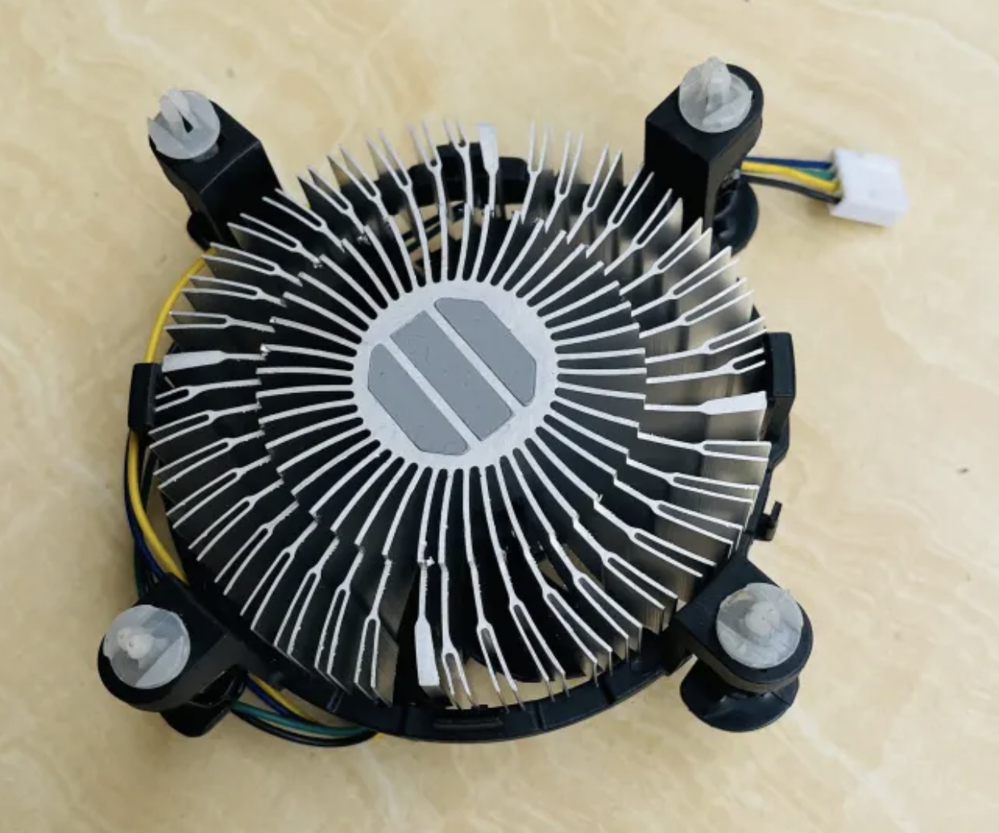
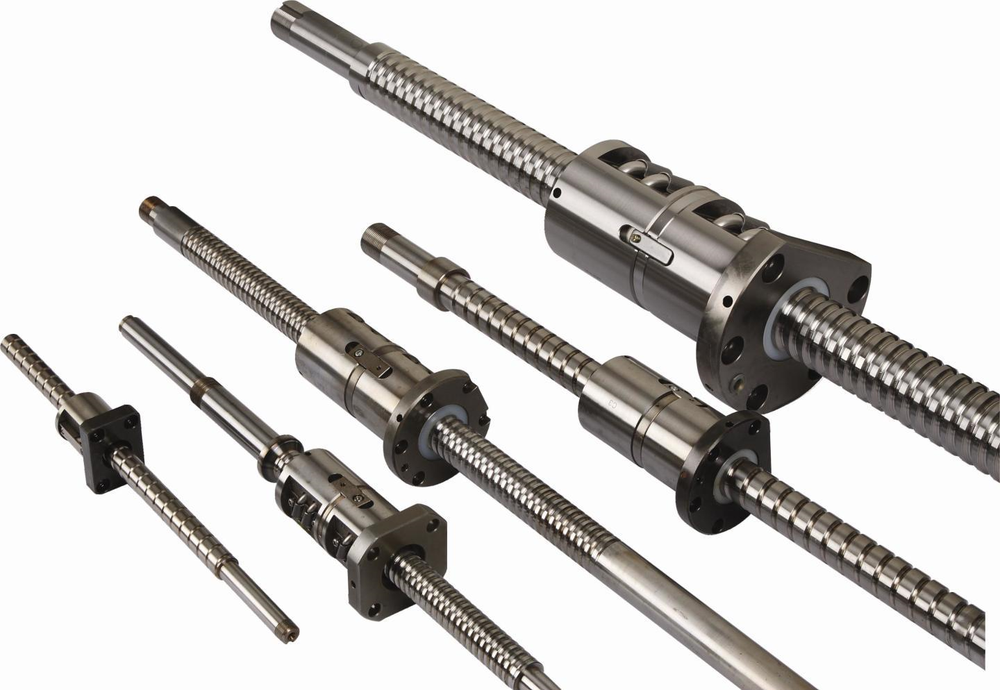

In the 1960s and 1970s, people had started to put together assembly-friendly design recommendations based on their actual design  experience and assembly practices. This was done to help designers design products that were easy to assemble. These recommendations were supplemented by real-life examples of how product design could be used to improve product assembly.

In 1977, Geoff Boothroyd introduced the concept Design for Assembly (DFA) for the first time and it was very much welcomed by the manufacturing industry. DFA aims to improve the assemblability of parts to reduce the time and cost required for assembly and improve assembly quality. In 1982, Professor Boothroyd proposed a system for assessing the assemblability of parts in the book named [Product Design for Manufacture and Assembly](https://www.amazon.com/Manufacture-Manufacturing-Engineering-Materials-Processing/dp/1420089277), which was used as the basis for the development of DFA software!

People often confuse DFA with DFM (Design for Manufacturing). DFM is oriented towards the production process of individual parts, while DFA is the design of the process flow during assembly and production. They are progressively related to each other, and DFA shall be carried out before DFM during design. Of course, experienced designers can conduct both DFM and DFA at the same time during structural design, which is called DFMA.

The purpose of DFA is to reduce development and production costs. Conducting DFA might take some time, around a month or so, but the outcome will save around 50% of each product’s assembly time. DFA should start from the initial design phase up until the end of the prototyping process, involving all personnel: sales, supply chain manager, and engineers. However, the person in charge for the whole DFA process should be the mechanical engineer. 

As engineers, we often find products that can pass some performance tests after being designed, but can hardly be manufactured. This manufacturing problem, commonly faced on the production line, is often caused by the differences in the operators’ knowledge backgrounds that were overlooked by designers during the design process.

Some of the common problems found in production line are as follows:
1. [Too many parts](#1-reduce-the-number-of-parts)
2. [Too many fasteners](#2-reduce-the-quantity-and-types-of-fasteners)
3. [Non-standard designs and inconsistent quality](#3-standardize-parts)
4. [Long queue at the assembly line](#4-modular-product-design)
5. [Multi-directional assembly process](#5-reduce-assembly-directions)
6. [Absence of assembly guides](#6-adding-design-guides)
7. [Wrong direction of part assembly](#7-fool-proofing) 
  
  

A few solutions for the said problems are as follows:

### 1. Reduce the number of parts 
**(time:cost = 8:2)**

During the assembly process on the production line, workers may sometimes miss some of the product's tiny parts. To reduce the number of parts to be assembled, several processes, such as ultrasonic welding, applying adhesives, or other additional processes could be done to reduce the number of parts to be assembled. 

Better yet, you could minimize the designed parts since the beginning of the design stage. For instance, Tesla had reduced the number of parts in their new car, from 70 parts into just 1. Optimizing the number of separate parts in a product is something you should keep in mind during the design process. Start thinking outside the box and be bolder in designing. 

Another example is this air purifier cartridge. The cartridge’s body has 3 different shades, showing that 3 different materials are used. The product can be divided into 3 separate parts for assembly.

### 2. Reduce the quantity and types of fasteners 
**(time:cost = 9:1)**

When using fasteners in your design, try to reduce the types of the fasteners in terms of the size, length and pattern. Doing this will reduce mis-operations during production and even reduce the number of tools to use during repair. 

### 3. Standardize parts 
**(time:cost = 3:7)**

Try to use standardized parts whenever you can. Fasteners have been standardized. Without special reasons such as for aesthetics and special sense of design, please be careful when you decide to use non-standardized parts. . Radiators, for example, is a product that can be made with standardized parts. At the beginning of the design, always check if the part can be purchased directly. Doing so reduces the cost of customization and guarantees quality stability.

This is a ball screw. People involved in manufacturing and assembly are no stranger to the part.  The process of designing a screw requires a high level of knowledge and a lot of time, whereas the procurement of standard parts requires only a few dimensional data, such as: threaded shaft outer diameter, lead, length, and shaft end type.

### 4. Modular product design 
**(time:cost = 9:1)**

Modular design can solve the problem of long assembly queue lines on production lines. We can make a product into several modules (or subassemblies), and each of these modules can be individually assembled and tested. In this way, the process could be made simpler with a higher assembly efficiency. Modular inspection can also be done to reduce the scrap rate.

For example, car manufacturers often modularize the components of a car. An example of doing so is by making the steering wheel a separate component. By doing this, the speed of the assembly doesn’t only gets faster, but it also provides room for personalization. 

### 5. Reduce assembly directions 
**(time:cost = 10:1)**

There are 6 basic assembly directions: up, down, left, right, front and back. When designing, try to design the assembly in just one direction. Doing this will reduce the rate of error in assembly since the product can be assembled only on one single tooling base.

 

 

### 6. Adding design guides 
**(time:cost = 10:1)**

Fitting different parts together is sometimes difficult due to the high tolerance requirements of such parts. In this case, designing assembly guides on the product will be a good choice. 

Using a chamfered or rounded corner at the end of the part, just like the shaft in the following figure, may facilitate the assembly process of the shaft with gears or bearings. If you have to control the mechanical vibration during the product's operation, using chamfered corners may further reduce the gap between the two moving parts.

### 7. Fool proofing 
**(time:cost = 10:1)**
 
Use a clear arrow to indicate the correct assembly direction, or create a structural guide, like slots, which are hard to miss.

Corner guides to indicate the direction of placement. 

Arrows on the part to indicate the assembly direction or component placement. 

DFA is conducted not only as a reminder to designers about the problems that often arise during assembling and producing products, but also to optimize the production process of products. After all, the best design is the simplest manufacturing.
