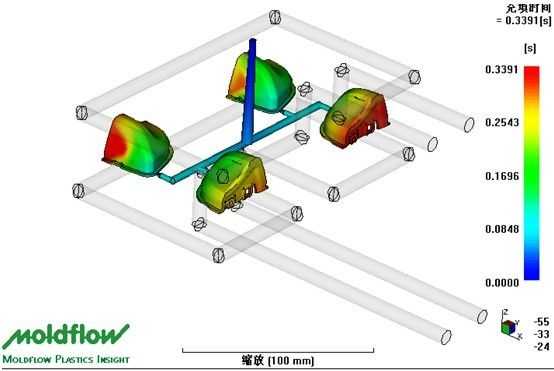
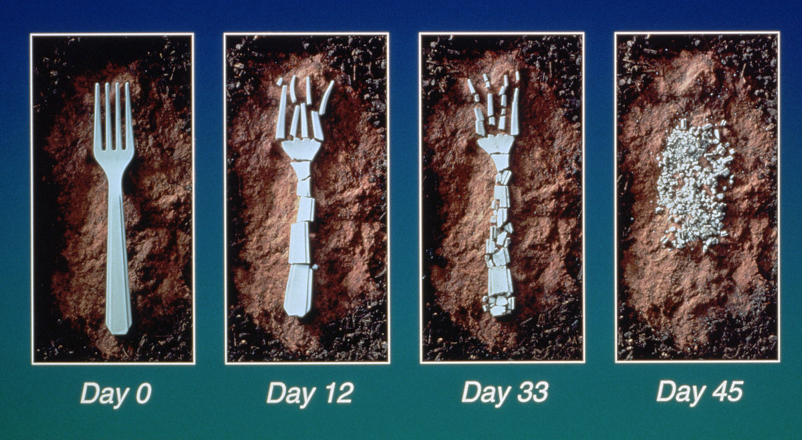
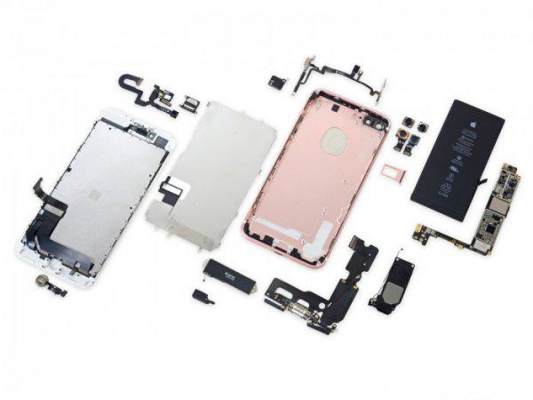
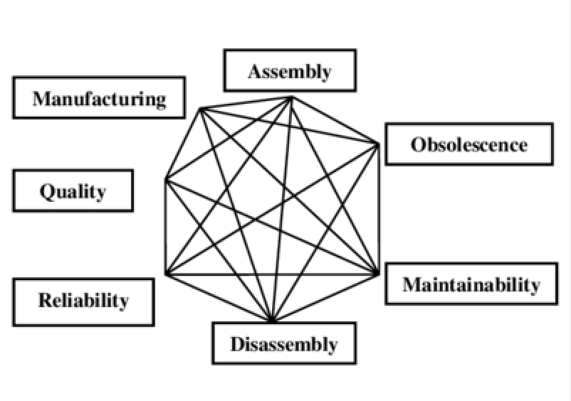

## Design Types and Services

During the process of developing a product, you'll be faced with various design approaches, each with a specialized requirements. **DFX**, or also known as **Design for X** or **Design for Excellence**, is a management theory which correlates different teams to contribute in the design process. By having this collaborative work across teams, the process of product design and manufacturing shortens the product development cycle, improve the product's quality, increase the company's reliability and customer's satisfaction, and ultimately shorten the entire product lifecycle from just the design concept into a ready made product. 

The different types of design included in the DFX family includes:                   
* Design for Supply Chain: DFSC                
* Design for Manufacture: DFM                  
* Design for Testability: DFT                
* Design for Assembly: DFA                          
* Design for Environmental: DFE                   
* Design for Serviceability: DFS                
* Design for Cost: DFC 

### 1. DFSC (Design for Supply Chain)

**Maturity**: Low 

**Personnel involved**: Product Designers, Procurement Engineers 

At the moment, DFSC has only been proven as a mere concept, with no definite methodology yet. However, the purpose of developing a DFSC strategy is crucial to establish the communication between the product designer and the supply chain personnel to confirm whether the designed product's parts should be made or bought. 

### 2. DFM (Design for Manufacture) 

**Maturity**: High 

**Personnel involved**: Suppliers, Process Engineers, Designers 

DFM is by far the most mature methodology throughout the whole DFX strategy. DFM involves the process of checking your design to verify its manufacturability early in the development process. This thus saves time and development costs, increases productivity, and reduces time to market. 

The process of DFM is generally conducted with multiple rounds of communication, which lasts for about a week each. The whole DFM process typically lasts for two months. If you are a product designer, we suggest that you don't conduct the process alone. Collaborating with your contract manufacturers will be a much greater option since different companies have different capabilities and preferences. 

In NexPCB, our experts conducts DFM efficiently through the cooperation between different suppliers and usage of different materials.   

This part is readily accessible from numerous software, including Solidworks:                          
[https://www.solidworks.com.cn/sw/products/3d-cad/design-for-manufacturability.htm](https://www.solidworks.com.cn/sw/products/3d-cad/design-for-manufacturability.htm) 

 

The image shown is a display of mold flow analysis, which can simulate the flow of plastic in the mold, and analyze the risk positions of material shortage, shrinkage, and deformation that affect structural performance.

### 3. DFT (Design for Testability)

**Maturity**: High 

**Personnel involved**: Testing Engineer, Process Engineer, Product Designer 

The process of testing is one of the most crucial parts in electronic product development. After producing the PCBA, the test engineer needs to put the PCBA on the test tool and burn in the program to test each function. 

[DFT Design for Testability](images/DFX-03.png)

### 4. DFA (Design for Assembly)

**Maturity**: High 

**Personnel involved**: Process Engineer, Production Department, Product Designer 

[DFA](/articles/DFA) focuses on easing the assembly process to be more efficient. This is done by minimizing the number of parts, tools, and processing to reduce the cost of labor hours during assembly. 

### 5. DFE (Design for the Environment)

**Maturity**: Low 

**Personnel involved**: Material Suppliers, Process Engineers, Product Designers 

If the material chosen is resistant to weathering, they should be degradable as much as possible. If the material is not resistant to weathering, consider using the same material to facilitate the process of disassembly and regeneration when the product is scrapped and recycled.                               
Currently, some of the most common degradable materials are PLA (polylactic acid), PHA (polyhydroxyalkanoate), and PGA (polyglutamic acid). 

### 6. DFS (Design for Serviceability)

**Maturity**: Medium 

**Personnel involved**: market, designer
Within a large batch of marketed product, you'll find a lot of the products require repairs or returned since it's damaged. The damage of a product during its utilization is inevitable, but are constantly reduced. Among the parts which made up the damaged product, there's usually one or a few parts that have a lower lifespan than the other parts. 
When dealing with this damage, the more vulnerable part should be separated into modular forms so it would be more convinient for later maintenance. By doing this, if a product is damaged due to this part, repair can be conducted more efficiently since only one part will be repaired. Thus reducing the risk of repair damage to the whole product.

 

As shown in the figure, the display screen and the battery are fragile, hence these two pieces are designed into two modules.

### 7. DFC (Design for Cost)

**Maturity**: High 

**Personnel involved**: Procurement Engineers, Product Designer 

Cost is the inescapable consideration all behaviors. Whether it is short-term or long-term cost, it is necessary to maximize the utilization of funds. During the process of designing a product, each of the parts' weight can be calculated using the software simulation. With this algorithm, the mechanical properties of a part can be adjusted. 

 

In this case, the left part can modified to reduce the material cost and transportation cost (can be packed in a more compact manner) by re-designing it to be like the part on the right. 

   

   

When evaluating the DFX design, you can’t just look at one of the optimizations. You need to consider all aspects comprehensively, because they are mutually restrained, and sometimes improving one of them affects the others. Decrease and increase.