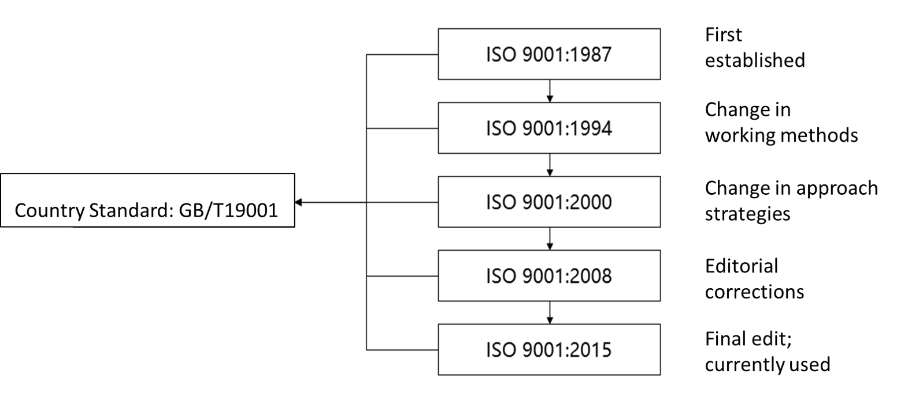

The International Standardization Organization (ISO) is the world's largest non-governmental specialized organization for standardization and a worldwide federation of national standardization organizations. Its purpose is: to promote the development of standardization work around the world, in order to facilitate international material exchanges and mutual assistance and to expand cooperation in knowledge, science, technology, and economy. Its main tasks are: formulating international standards, coordinating standardization work around the world, and cooperating with other international organizations to study related standardization issues. ISO standards refer to standards formulated by the "International Organization for Standardization".

>  In addition to the normative names, ISO International Standards also have numbers. The format of the numbering is:_"ISO"_ + _standard number_ + \[_bar_ + _sub-standard number_\] + *":" + _release year_ (contents in square brackets are optional, for example: ISO8402:1987, ISO9000-1:1994, etc., respectively a certain one standard number).

 The ISO9000 standard is a concept proposed by the International Organization for Standardization (ISO) in 1994. It refers to "an international standard formulated by ISO/TC176 (International Organization for Standardization Quality Management and Quality Assurance Technical Committee) and has been continuously developed and changed. Since its release, more than For 30 years, it has undergone four revisions, namely 1994 and 2000, 2008, 2015, etc. After four revisions, the latest version is the 2015 version.

 "ISO9000" does not refer to a standard, but is a general term for a family of standards, mainly including four core standards: ISO 9000, ISO 9001, ISO 9004, and ISO 9011, of which ISO 9001 is the standard requirement for third-party certification.

References: "Quality Management System Auditor", "ISO9001 Standard Clauses", etc.

## ISO 9001:2015 --- Quality Management System

* **Nature**: Certification standard.
* **Description**: specifies the requirements for a quality management system that can be used both internally and externally by the organization (including certification bodies) to assess the organization's ability to meet customer, legal and regulatory requirements and the organization's own requirements.
* **Purpose**: to establish an ISO9001 quality management system; to improve customer satisfaction by providing customers with products that meet their requirements.

### Development of ISO9001:2015

As the core standard of quality management systems, ISO9001 has went through many improvements. The final 2015 version has the following features:

* **Effect of Feature Improvements on Organizations**: How much the revised ISO 9001 standard affects an organization depends on the organization itself and how its own quality management system (QMS) has developed along the way. Factors such as the maturity and complexity of the existing ISO 9001:2008 management system, the existence of other management systems (such as ISO 14001 - Environmental Management System or OHSAS 18001 - Occupational Health and Safety Management System), and the organization's existing assessment and management of risk Both will greatly affect the degree of change an organization will have to make to meet the requirements of ISO 9001:2015.
* **Appendix**: The adoption of Appendix SL is the biggest change to the ISO 9001:2015 document. Annex SL identifies common terms and definitions that apply to all ISO Management System Standards (MSS), featuring a consistent framework of 10 clauses. As organizations begin to understand and appreciate the value of a common language across different management systems, there is no doubt that organizations and their customers will be the real beneficiaries
* **Process-Based Approach (Process Approach)**: Several articles in the 2015 edition mention that organizations should pay more attention to applying a process-based approach to their management systems.
* **Risk-Based Approach**: Annex SL was incorporated into ISO 9001:2015 to drive organizations to adopt a risk-based approach to thinking and acting. The requirements associated with this risk-based approach will impact the quality plan while incorporating most of what was formerly known as "precautionary measures". Organizations will now need to identify the risks and opportunities that should be addressed in order to provide assurance that the quality management system (QMS) will achieve its intended effect. Many organizations already have risk-based ideas and plans in many ways that may or may not have been previously linked to their QMS. The increased emphasis on risk means that organizations will need to demonstrate how they meet this requirement. The specific application and formality of this approach in an organization will be influenced by the organizational context.
* **Leadership**: The role of top management in creating and supporting an effective QMS has been increased. There are now more places where top management is required to demonstrate their involvement and commitment to the QMS, including taking responsibility for its effectiveness and ensuring that the QMS is integrated with overall business processes.
* **Organizational Environment**: This is a new addition and has two meanings. First, the environment requires the organization to identify internal and external issues and requirements that can affect the planning of the quality system. The environment will be an important consideration, helping to ensure that its management system is designed for its own organization. This helps organizations identify the appropriate focus and approach that is right for them, and achieve a balance between the different elements of the management system, rather than adopting the same general approach across all organizations. Second, consider stakeholders. The standard requires the organization to identify the needs of interested parties and to ensure that these requirements are monitored and reviewed, as these requirements will be the main input when designing the QMS.
* **Knowledge**: The organization will now need to consider what knowledge it needs to achieve product or service compliance, and how it should develop and maintain that knowledge.
* **Control of Externally Provided Products and Services**: Formerly called "Procurement", the title of this clause has been renamed to make it clear that this requirement applies to both tangible products and services related to the organization's end product. While this is not a new requirement, there has always been confusion around certain categories of products and services offered externally. What is now clear from this provision is that, however, provided, the organization will need to apply a risk-based approach and determine the type and extent of controls necessary.

### Why ISO9001 Certification

The ISO9001 Certification has its own unique functions:

1. Strengthen quality management to provide corporate benefits, by enhancing customer confidence and expanding market shares.
2. Obtain a "pass" and eliminate barriers to international trade.
3. Save the effort and expense of second-party audits.
4. Add product competitiveness through quality.
5. Effectively avoid product liability.
6. Assist efficient international economic cooperation and technical exchanges.

According to the practice of international economic cooperation and technical exchanges, the parties involved in the process must have a common language, unified understanding, and common norms for product (including service) quality in order to carry out cooperation and exchanges. The ISO9000 Quality Management System Certification provides a trusting foundation, which is conducive to the rapid agreement between the involved parties.

### ISO 9001:2015 7 Basic Principles

#### **1. Customer focus:** 

The main focus of quality management is to meet customer requirements and strive to exceed customer expectations.

* **Theoretical basis:**  
  Organizations can only achieve sustained success by earning the trust of their customers and other interested parties. Every aspect of interaction with customers provides an opportunity to create more value for customers. Understanding the current and future needs of customers and other interested parties contributes to the continued success of the organization.
* **Main (potential) benefits:**
  * Increase customer value
  * Improve customer satisfaction
  * Increase customer loyalty
  * Increase recurring business
  * Improve your organization's reputation
  * Expand customer base
  * Increase revenue and market share
* **Actions:**
  * Understand the direct and indirect customers who derive value from the organization.
  * Understand the current and future needs and expectations of customers.
  * Link the organization's goals to customer needs and expectations.
  * Communicate customer needs and expectations throughout the organization.
  * Planning, designing, developing, producing, delivering and supporting products and services to meet customer needs and expectations.
  * Measure and monitor customer satisfaction and take appropriate action.
  * Identify the needs and expectations of interested parties that may affect customer satisfaction, and identify and take action.
  * Actively manage relationships with customers to achieve sustained success.

#### **2. The role of leadership**

Leaders at all levels establish a unified purpose and direction, and create conditions for full participation in order to achieve the organization's quality goals.

* **Theoretical basis**:  
  Unified purpose and direction, and full participation, enables the organization to align strategies, policies, processes and resources to achieve its goals.
* **Main (potential) benefits:**
  * Improve the effectiveness and efficiency of achieving organizational quality objectives.
  * Organizational processes are more coordinated.
  * Improve communication between organizational levels and functions.
  * Develop and enhance the capabilities of the organization and its people to achieve expectations and results.
* **Actions:**
  * Communicate across the organization its mission, vision, strategy, policies, and processes.
  * Create and maintain shared values and fair and ethical behavior patterns at all levels of the organization.
  * Foster a culture of integrity and integrity.
  * Encourage an organization-wide commitment to quality.
  * Ensuring that leaders at all levels become practical role models among the people in the organization.
  * Increase the resources, training, and authority required for organizational personnel to perform their duties.
  * Motivate, encourage and recognize the contributions of employees.

#### **3. Full Participation**

The competence, authorization and participation of personnel at all levels in the entire organization is a necessary condition for the organization to improve the organization's ability to create value and provide value.

* **Theoretical basis**:  
  The competence, authorization and participation of personnel at all levels in the entire organization are necessary conditions to improve the organization's ability to create value and improve value。
* **Main (potential) benefits:**
  * To achieve its goals through the deep understanding of the quality objectives and the stimulation of the internal motivation of the people in the organization.
  * Increase the participation of people in improvement activities.
  * Promote personal development, initiative, and creativity.
  * Improve employee satisfaction.
  * Enhance trust and collaboration across the organization.
  * Promote a focus on shared values and culture across the organization.
* **Actions:**
  * Communicate with employees to increase their importance and awareness of their individual contributions.
  * Facilitate assistance across the organization.
  * Promote open discussion and sharing of knowledge and experience.
  * Let employees identify constraints in their work and participate actively without hesitation.
  * Appreciate and recognize the contribution, research spirit, and progress of employees.
  * Self-assessment of performance against personal goals.
  * Conduct surveys to assess employee satisfaction and communication results, and take appropriate action.

#### **4. Process Approach**

When activities are systematically managed as interrelated functional coherent processes, it is more effective and efficient to consistently achieve expected results.

* Theoretical basis:  
  A quality management system consists of interrelated processes. Understanding how systems produce results enables an organization to improve its systems and performance as much as possible.
* Main (potential) benefits:
  * Increased ability to focus on key processes and opportunities for improvement.
  * Through a coordinated and systematic process, the expected results are always obtained.
  * Improve its performance as much as possible through effective process management, efficient use of resources, and reduction of functional cross barriers.
  * Enables the organization to provide stakeholders with trust in its consistency, effectiveness, and efficiency.
* Actions:
  * Determine what the system and processes need to achieve.
  * Determining management responsibilities, authorities, and obligations for the management process.
  * Understand the capabilities of the organization and determine resources and constraints in advance.
  * Identify process interdependencies and analyze the impact of changes in individual processes on the overall system.
  * Manage the processes of the system and their interrelationships to effectively and efficiently achieve the organization's quality objectives.
  * Ensuring that necessary information for process operation and improvement is obtained, and monitoring, analyzing, and evaluating the performance of the entire system.
  * Manage risks that can affect process outputs and the overall structure of the quality management system.

**5. Improvement**  
Successful organizations are always committed to continuous improvement.

* Rationale: Improvement is necessary for an organization to maintain current levels of performance, to respond quickly to changes in internal and external conditions, and to create new opportunities.
* Main (potential) benefits:
  * Improve process performance, organizational capability and customer satisfaction.
  * Increased focus on investigation and determination of underlying causes and subsequent preventive and corrective actions.
  * Improve the ability to anticipate and respond to internal and external risks and opportunities.
  * Increase consideration of growth and breakthrough improvements.
  * Improvement through reinforcement learning.
  * increase the impetus for reform.
* Actions:
  * Facilitate the establishment of improvement objectives at all levels of the organization.
  * Train employees at all levels to understand how to use basic tools and methods to achieve improvement goals.
  * Ensuring that employees have the ability to successfully set and accomplish improvement goals.
  * Develop and deploy improvement projects implemented across the organization.
  * Track, review and audit the planning, implementation, completion and results of improvement projects.
  * Incorporate new product development or changes to products, services and processes into improvements.
  * Appreciate and recognize improvements.

**6. Evidence-based Decision-making**  
Decisions based on analysis and evaluation of data and information are more likely to produce desired outcomes.

* Rationale:  
  Decision-making is a complex process and always contains some uncertainties. It often involves multiple types and sources of input and its interpretation, which can be subjective. It is important to understand causality and potential unintended consequences. Analysis of facts, evidence and data can lead to more objective and therefore more confident decisions.
* Main (potential) benefits:
  * Improve the decision-making process.
  * Improve assessment of process performance and capability against realistic targets.
  * Improve the effectiveness and efficiency of operations.
  * Increase the ability to review, challenge and change opinions and decisions.
  * Increase the ability to demonstrate the effectiveness of past decisions.
* Actions:
  * Identify, measure and monitor key indicators that demonstrate organizational performance.
  * Enable relevant personnel to obtain all the data they need.
  * Ensure that data and information are sufficiently accurate, reliable and secure.
  * Analyze and evaluate data and information using appropriate methods.
  * Confirming that personnel are competent to analyze and evaluate the data required.
  * Make decisions and take action based on evidence, weighing experience and intuition.

**7. Relationship Management**  
For continued success, an organization needs to manage its relationships with interested parties such as suppliers.

* Rationale:  
  Stakeholders influence organizational performance. Organizing and managing relationships with all interested parties to maximize their role in organizational performance. It is very important to manage the network of suppliers and partners.
* Main (potential) benefits:
  * To improve the performance of the organization and its stakeholders by responding to each stakeholder-related opportunity and constraint.
  * Shared understanding of goals and values with relevant parties.
  * Increase the ability to create value for interested parties by sharing resources and capabilities, and managing quality-related risks.
  * A well-managed supply chain that enables a steady flow of products and services.
* Actions:
  * Ensuring the relationship between the organization and relevant parties (e.g. suppliers, partners, customers, investors, employees or society as a whole).
  * Identify the relationships of interested parties that need to be managed with priority.
  * Establish relationships that weigh short-term benefits against long-term considerations.
  * Collect and share information, expertise and resources with interested parties.
  * Where appropriate, measure performance and report to interested parties to increase initiatives for improvement.
  * Development and improvement activities with suppliers, partners and their stakeholders.
  * Encourage and recognize improvements and achievements by suppliers and partners.

### The relationship between ISO9001 standard and other management systems

This standard adopts the management system standard framework developed by ISO to improve compatibility with other management systems.This International Standard enables organizations to use a process approach, incorporating the PDCA cycle and risk-based thinking, to harmonize or integrate their quality management system requirements with the requirements of other management system standards.

* ISO9000 "Quality Management System Fundamentals and Terminology" provides the necessary basis for the correct understanding and implementation of this standard.
* ISO 9004, "Quality management methods in pursuit of an organization's continued success", provides guidance for organizations to choose a quality management method that goes beyond the requirements of this International Standard.

This standard does not include special requirements for other management systems such as environmental management, occupational health management and safety management or financial management.
On the basis of this standard, several quality management system standards with industry-specific requirements have been developed. Some of these standards specify additional requirements for quality management systems, while others are limited to providing guidance for the application of this standard to specific industries.

## ISO 14001:2016 Environmental Management System

The ISO14000 is a series of standards specially formulated for environmental management, which is adopted voluntarily. The ISO14000 series was designed based on the success of the ISO9000 standard. Hence, the standard is easy to utilize, flexible, and applicable to organizations of any types and sizes in different geographical, cultural and social aspects. The ISO14000 series standards are very compatible with the ISO9000 standard, so that enterprises can effectively coordinate with the original management system when adopting ISO14000 series standards. **"Prevention first"** is the leading idea running through the ISO14000 series of standards, which requires companies to commit and conduct pollution prevention procedures.**Continuous improvement** is the soul of the ISO14000 series of standards. The organization establishes a continuous improvement mechanisms through the implementation of standards. In the process of continuous improvement, it realizes its commitment to the society and finally achieves the goal of improving environmental performance.

### ISO14000 Certification process

**1. Establish and Implement ISO14000**

The establishment and implementation of the ISO14001 environmental management system follows the voluntary principle, and the top management of the organization decides whether to establish and implement the ISO14001 environmental management system. If the organization decides to establish a system, it should complete the following aspects:

1. Make preparations in terms of people, money, and materials. The environmental management representative is appointed in writing by top management. Top management should authorize the establishment of corresponding institutions, and provide human and financial support to ensure the establishment and operation of the system.
2. Do an initial environmental review. This work is to evaluate the environmental management of the organization, summarize experience, find out the main environmental problems and analyze their risks, so as to determine the control methods and future improvement directions.
3. Complete the environmental management system planning. The environmental management system planning is to:
   * Formulate environmental policies according to the results of the initial environmental review and the economic and technical strength of the organization.
   * Determine the framework of the environmental management system.
   * Determine the organizational structure and responsibilities.
   * Formulate goals, indicators, and environmental management .
   * Determine which environmental activities Operational control procedures need to be developed.
4. Prepare system documents. The ISO14001 environmental management system is a documented environmental management system, which requires the preparation of environmental management manuals, procedural documents, work instructions, etc.
5. Run the environmental management system. When the environmental management system documents are completed and officially promulgated, it indicates that the environmental management system has been established and put into operation.

**2. Certification and Forensics**

After internal audit and management review, if the organization confirms that its environmental management system basically meets the requirements of the ISO14001 standard, has good applicability to the organization, and operates adequately and effectively, it can apply to an organization that has obtained certification from the China Environmental Management System Certification Body Accreditation Committee. The certification body submits a certification application and signs a certification contract, and enters the ISO14001 environmental management system certification audit stage.

* Certification audit is a process in which the certification body is entrusted by the organization to audit and verify the compliance, operation and maintenance of the organization's environmental management system with the ISO14001 environmental management system standard as a third party, and determine whether to issue a certificate to the organization.
* To be audited by a certification body, the organization should be well prepared to keep the system functioning effectively. The certification body will send an audit team, and the audit team will conduct certification audits for the organization. The certification audit includes the first stage audit and the second stage on-site audit. After the organization completes the non-conformity correction issued by the second stage on-site audit and is verified and closed by the audit team, the organization will determine whether to approve the organization's certification registration and issue the certification certificate after certification assessment.
* The certification certificate is valid for three years. Within three years, the organization has to accept the supervision and audit of the agency for many times; after three years, the organization has to apply for a review and re-register to obtain the certificate. This process is the same as the first certification and evidence collection.

## ISO 45001:2018 Occupational Health System

The predecessor of ISO45001 Occupational Health and Safety Management System is the OHSMS18000, which is a modern safety production management mode that emerged internationally in the late 1980s.
An important reason for the emergence of an occupational health and safety management system is the **need for the globalization of the world economy and the development of international trade**. The most basic principle of the WTO is "fair competition", which includes environmental and occupational health and safety issues.
The main reason for the emergence of the occupational health and safety management system is the requirements of the enterprise's own development. With the expansion of enterprise scale and the improvement of production intensification, higher requirements are put forward for the quality management and operation mode of enterprises. Enterprises must adopt a modern management model to make all production and operation activities, including safety production management, scientific, standardized and legalized.

1. System diagnosis and establishment.  
   At this stage, it is necessary to contact the counseling agency, and the counseling agency will help it conduct preliminary guidance and training, understand the standard requirements, and establish corresponding management manuals, control procedures and other documents according to the actual operating conditions of the enterprise.
2. Publicity and implementation of training.  
   After the counseling organization helps enterprises to establish manuals, procedures and other documents, they will conduct corresponding trainings for enterprises and explain in detail various problems that may be encountered during the operation of the system.
3. The system has been running for 3 months. During the operation of the system, corresponding record files will be generated according to the requirements of the standard.
4. Internal audit.  
   After the system has been running for a period of time, the enterprise needs to conduct internal audits, management reviews, etc., in order to independently discover and solve problems existing in the operation of the system; review the suitability of management manuals and management procedures, and seek opportunities for improvement.
5. Submit an application for certification.  
   After the issues in the internal audit and management review have been resolved, an application for certification can be submitted to the certification body.
6. Document review.  
   After the certification body receives the enterprise's certification application, it will conduct a preliminary document review. After confirming that there is no problem, it will negotiate with the enterprise on the time of the on-site audit.
7. On-site audit.  
   The certification body sends an audit team to audit the business premises of the enterprise according to the agreed time.
8. Issuance of certificates.  
   The enterprise solves the problems found in the on-site audit and submits it to the audit team for verification, and the certification body issues the certification certificate.