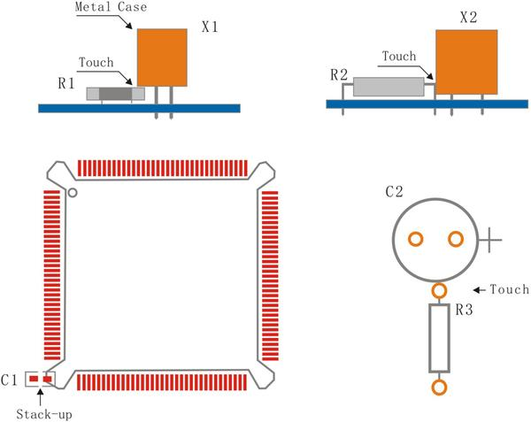
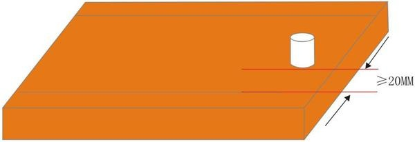
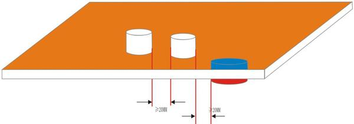
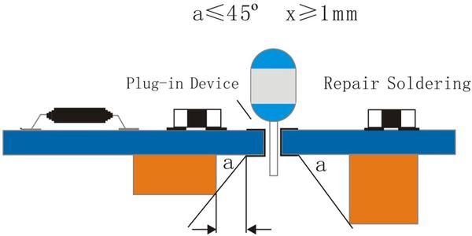
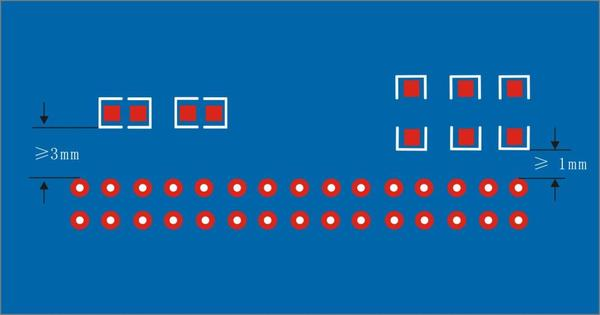
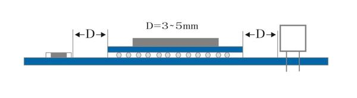
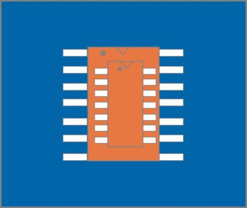
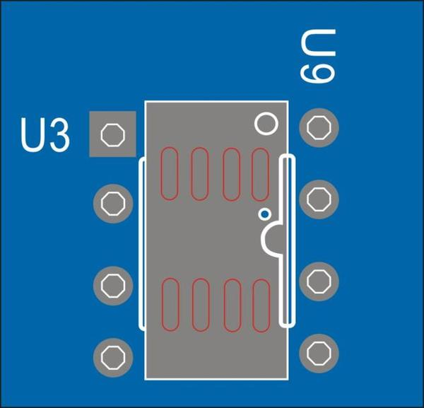

## Component Placement

### General rule for component placement: 

- Through-hole (THT) components with polarity must be placed in the same direction, as neatly as possible. 

- If positioning SMD components in the same direction is not possible, just organize them in the same X or Y direction. 

- Leave at least 0.5mm in between SMD components, to locate heat sinks. 

- Thermosensors, such as electrolytic capacitors or crystal oscillators, should be kept far away from high heat elements; and they should be placed on the windward side. 

 

- Components with taller figures should be placed behind the shorter components in the direction of the least wind resistance, to prevent air duct from being blocked. 

- Avoid touching or stacking of components to provide space for component installation. 

 

- High heatload components, such as power inductors or power regulators, shoud not be placed to get too close to the technology edge (or panel edge), and the distance to the edge must be above 20mm to avoid uneven temperature of reflow oven guide rail that may affect soldering. 

 

- High heatload components should be at least 20mm apart from each other to avoid large PCB partial heat load. 

 

### Through-hole (THT) Component Placement 

- All polar THT components must be placed on its positive side, unless they are special structural components. 

- The distance between adjacent components must be at least 0.5mm. 

 

- When SMD components are placed on the opposite side from the THT components, there should be at least 1mm distance between a THT component's leads and the opposite side's SMD component. The angle of elevation ofd the adjacent SMD component's height is at most 45 degrees. The measures are meant to meet the operating space of manual soldering, maintenance and inspection requirements. 

 

- When SMD components are placed on the same side as the THT components, the pad edge must be at least 3.0mm for parallel placements, and 1.0mm for vertical placements. 

 

### Surface-mount Device (SMD) Component Placement

- Fine-pitch components (including BGA [insert link!!!], 0.4mm, and 0.5mm QFP) are recommended to be placed on the same side. 

- The angle of elevation of SMD components should be less than 60 degrees to ease the soldering joint inspection process. 

 

- BGA components must be at least 3.5mm apart from the next component. 

 

- QFN components must be at least 2.0mm apart from the next component. 

- A surface-mount module must be at least 2.0mm apart from the next component. 

- SMD with 'wings' or multiple leaded sides, such as SOPs, QFJs, and QFPs should not be positioned on top of each other. 

- THT and SMD components can be placed stacked on different layers, as long as the THT soldering does not interfere the SMD pad and the printed solder paste. 

 

- The minimum gap of neighboring SMD components with the same variety is 0.5mm.

- The placement of neighboring SMD components of different kinds should have a maximum elevation angle of 60 degrees. 