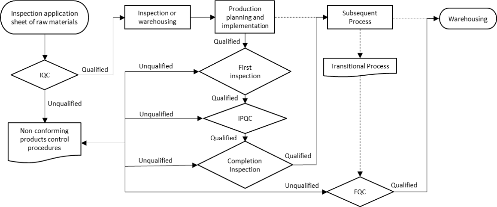
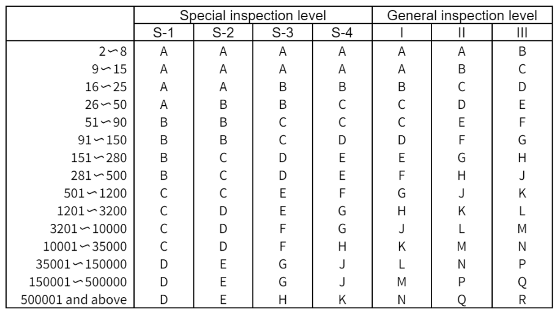

**Introduction:** 

Quality inspection is observing, measuring and testing one or multiple items of quality characteristics, and comparing the results with the prescribed quality requirements, so as to determine whether the quality of such items can be accepted or not; it is one integral part of the production process by which quality managers can single out and reject defective goods, in a bid to meet the requirements of customers. Also, performing quality inspection can predict the occurring of defective goods in a timely manner.

## Purpose 
Identify the level of product quality, and decide how much they are in line with the prescribed standards and whether they can be accepted or not. 

## Importance
1. Evaluation on product quality 

Quality inspection are important to ensure products are process in accordance with the technical standards, product design, operating (technical) specifications or ordering contracts and technical agreements. The inspection uses various testing and inspection methods to observe, test and measure the quality of products and determine whether the it meets the specified requirements.

2. Control on product quality 

Control is the most fundamental function of quality inspection, which can also be referred to as quality assurance function. Manufacturing is a complex process, in which a number of factors, such as human, machinery, materials, methods, environment, and survey, may possibly bring changes to production status, and there is no way that each working process stay at an absolute state. In other words, even though techniques are done to maintain the products' qualities, it is impossible to have all products to be qualified during all the production stages. So, quality control become an essential function. Thanks to the continuous advancement of production technologies and gradual improvement of management, quality inspection processes can be reduced. However, it will never be eliminated.

3. Prevention of the occurrence of non-conforming products 

The most important aspect that distinguishes modern quality inspection from traditional one is that the former focuses on prevention. 

* **First-piece inspection and patrol inspection play a role of prevention in production process**          
When a group of products stay at an initial production state, usually first-piece inspection shall be conducted. Only after the quality of the first-piece product has been accepted, can massive production be performed; in addition, the first-piece inspection shall be carried out when the equipment is repaired or readjusted. After the official massive production, patrol inspection is required at regular or irregular intervals to find out whether there is any change during production. Any problem, once identified, shall be timely corrected to prevent the occurrence of non-conforming products. When the products of a day or a group are finished, the final inspection can be conducted to ensure qualified characteristics of the whole batch.

* **Determination of process capability and introduction of control charts among other means can play a role of prevention**           
Either determination of process capability or control charts can be secured only after a batch or a group of data, which are gathered through product inspection, have been subjected to statistics. The purpose of such inspection is not to determine whether products are qualified or not, but to figure out the level of process capability and the stability of the production process. In case of insufficient process capability or abnormal states in the production process displayed by control charts, appropriate measures shall be timely taken to enhance such capability or eliminate all abnormal factors from the production process.

4. Reports and feedback on product quality information 

To enable top management and quality managers to (1) timely have knowledge about product quality status amidst production and conduct evaluation and analysis on effectiveness of the quality system; and (2) make correct decisions as to quality and understand quality situation, inspection results, not least various indicators based on calculation, must, in the form of report, be given to the decision-making department and relevant management departments, so as to make correct decisions and take effective measures. The content of the reports may include several respects below:
>   1. Raw materials, purchased products, workshop inspection of outsourced products, and percentage of qualified products. 
2. Percentage of qualified products, percentage of reworked products, scrappage and AOD of ex-factory inspection, as well as corresponding loss amount.
3. Average percentage of qualified products, percentage of reworked products, and corresponding amount of money as well as analysis based on workshops, groups, production lines and projects.
4. Cause and analysis of scrapped products.
5. Report on the handling of non-conforming products.
6. Report on the investigation, analysis and treatment for major quality issues.
7. Report on recommendations for quality improvement. 
8. Report on the work of inspectors. 
              

5. Improvement of product quality 

Quality inspectors are usually technical professionals or technical workers experienced in production inspection and business. They are able to put forward down-to-earth recommendations and measures. A lot of practice has proved that better results could be achieved if designers, workers, inspectors and operators are involved in quality improvement together. 
Supervision and verification functions.               
Based on inspection, quality supervision and verification are objective demands for market economy and quality assurance, which falls into the following five respects:
* Self-supervision
* Customer supervision
* Public supervision
* Legal supervision
* State supervision

## What are the ways of quality inspection? 
Based on the number/quantity inspected, characteristic values of quality and inspection methods, the ways of quality inspection are divided as follows: 

1. By the quantity characteristic of the inspection 

* **Full products inspection (full inspection)**          
Full inspection is conducting 100% inspection on all products to be inspected, having disadvantages of large workload, long period and high cost among others. In addition, some of inspection items are destructive, and, thus, 100% inspection is not a possible solution in this regard. As a result, full inspection, unless necessary, is not an option. NexPCB calls for 100% full inspection in the situations below, 
  * High-precision products or components
  * Quality items that have a major impact on subsequent processes
  * Processes in which quality is not stable
  * Reworked products 

**Sampling inspection (SI)**
According to a properly-designed sampling program based on the theory of mathematical statistics, draw a random sample from total products to be inspected, conduct all-item inspection on each and every individual product of the sample, obtain statistic values of the sample for quality characteristic values, compare such values with corresponding standard values, and eventually draw a conclusion for the total number; drawbacks or limitations of the full inspection are precisely strengths of the selective inspection; nevertheless, the latter also has some flaws, where qualified lots may be determined as unqualified ones, and also unqualified lots as qualified ones. Meticulously-designed sampling programs based on the theory of mathematical statistics can reduce or control, but not totally avoid, the risk in erroneous determination.

2. By the quality characteristics value of the inspection
* Inspection by attributes: suitable for the scenarios where quality characteristic values are based on points or pieces; this mode has so far been widely applied by NexPCB.
* Inspection by variables: suitable for the scenarios where quality characteristic values are based on measurement.

3. By the characteristics of the inspection method
* Physical and chemical inspection: Gauges and instruments are used to conduct physical/chemical inspection on products to be inspected. This way offers specific numbers that can be quantified, with high precision and with less human error. Modes frequently used by NexPCB are the vernier caliper measurement, height gauge measurement, tension test, surface impedance test, electrostatic voltage test, material hardness test, etc.
* Sense organ-based inspection: Evaluation or determination are made for product quality or characteristics through a human's five senses. This includes the inspection of shapes, colors, odors, scratches, and erosion. To minimize differentiation in human determination, inspectors will compare products with approved samples and defective samples.

## What are the types of quality inspection?
Inspection activity falls into three major types: **incoming quality control (IQC), process control and final quality control (FQC)**.

### 1. Incoming Quality Control (IQC)
IQC refers to the quality verification on purchased materials, namely inspection on purchased raw materials, auxiliary materials, purchased products, outsourced products and supporting products prior to warehousing. 

The extent of IQC comes down to how much a buyer trusts the supplier’s quality system. A buyer can develop a quality monitoring system for the supplier, such as regular quality audits on the supplier and on-site supervision of the supplier's quality assurance by the staff assigned at key stages of the production process. For example, NexPCB assigns QC personnel to the supplier’s production lines supervising key injection molding products, screen printing and other important processes;
Incoming materials must come with certificates or other legitimate documents; otherwise, they cannot be accepted. The supplier’s inspection certificates and records shall be in line with the buyer’s requirements, and shall at least include the inspection data about quality characteristics that affect acceptability of the materials.

### 2. In-process quality control (IPQC)
This is also known as process inspection, is intended to prevent a large number of non-conforming products from occurring during manufacturing, so as to avoid non-conforming products entering the next process.
Process inspection covers not only whether finished products meet the prescribed quality requirements, but also major influential factors such as human, machinery, material, method, environment and survey, so as to determine whether production process is under proper control. Process inspection falls into the following three forms:
1. First piece inspection                  
Inspect the first product or the first three ones after each shift starts working          
This inspection shall also be implemented whenever working condition changes, like switching equipment, changing materials or workers, etc. First piece inspection can be done by foreman or full-time QC personnel. 

2. Patrol inspection                     
Inspectors conduct patrol inspection on the manufacturing process at workshops, and NexPCB assigns full-time IPQC personnel to conduct patrol inspection and document the results.

3. Last piece inspection                                
In the scenario where quality of component manufacturing relies on molds and equipment, the last piece or last three pieces shall be inspected when the lot is finished. It is intended to make ready for the production of the next lot, ensuring a proper technical state for the next lot of products.                              
Generally, last piece inspection is jointly conducted by OC personnel and operators.

### 3. Final Quality Control (FQC)
FQC is a key means through which semi-finished or finished products are fully inspected to see whether they are in line with appropriate design codes. It is the last chance that a supplier checks whether its products are in line with customer’s requirements, and thus it is an important part of the supplier's quality assurance. 

FQC of finished products generally falls into two types: acceptance inspection and quality examination of the finished products (subject to customer participation and final approval by the customer). It can be conducted by full inspection or sampling inspection. NexPCB will choose full inspection as per customer requirements. 

## Quality inspection system:
The quality inspection system plays an essential role to strengthen the organization and management of quality inspection in the quality management process. The system is used in eight different ways: 

**1. Three-inspection system** 

* Self-inspection:               
The manufacturer will be responsible for its own products, conduct self-inspection as per drawings and technical requirements, and make the conformity determination. 
* Mutual inspection:          
The process involves mutual inspection among production workers. This includes
  * Sampling inspection or full inspection of some characteristics of semi-finished products coming from the previous process to the next process. 
  * A mutual inspection of the same machine tool and process at the handover.
  * Inspection by the foreman to the staff in the group.
* Special inspection:          
Special inspections are conducted by full-time professional inspectors. The three-inspection system must be dominated by special inspection since full-time inspectors have more reliable and efficient technical requirements, process knowledge, and inspection skills for the products than others. NexPCB assigns full-time inspectors for property tests and visual inspections. 

**2. Double-post system for key processes** 

A key process must be attended by both an operator and an inspector, and, if necessary, by the chief engineer or the customer’s site representative. The processes to be supervised must be carried out according to the prescribed procedures. 

**3. Signature system** 

During the production process from the raw materials entering the plant to the finished product entering the warehouse, whenever one process is over or product status is changed, including the inspection, handing over, storage and transport, the responsible person shall sign relevant documents to show their sense of responsibility. Signature on documents or stamping of quality inspection seal by an inspector is a key technical responsibility system. The operator’s signature indicates that the process has been completed in accordance with the specified requirements, while the inspector’s signature indicates that the process has reached the prescribed quality standard.

**4. Quality rechecking system** 

This quality check is done for several important products, such as ones ready for delivery or testing. The process is done to ensure that they offer reliable quality without hidden problems. Personnel from design, production, testing, or engineering departments shall conduct rechecking before delivery. Before NexPCB delivers products, QE engineers will conduct sampling inspections on such products on an irregular basis.

**5. Tracing system** 

Tracing systems are also known as tracking management. The system records all information for every single process or job. Whenever one process or one job is finished, the name of the operator and inspector, time, location and result analysis shall all be recorded. This greatly strengthens the staff’s sense of responsibility.

**6. Quality statistics and analysis system** 

The workshop and quality inspection department of the company summarizes, calculates, and analyzes various quality indicators in production. These data are then reported to the company on a regular basis, to reflect the changes and trends in the production quality. The process done was based on the senior management requirements and quality status of the company. Every month, NexPCB’s quality department submits a written quality statistics report to the management, to facilitate the management to control the quality situation.

**7. Non-conforming products management system** 

This is an important content of both quality inspection and the overall quality management. The management on non-conforming products must observe the following principles.
* Principle A: Do not accept, make or deliver any defective goods.
* Principle B: Do not put an end to the investigation of non-conforming products if the cause has yet to be found out, responsible people have yet to be identified, and improvements yet to be made. 

There are two main tasks that should be done properly during the site management of non-conforming products:
* First, the marking of non-conforming products.
* Second, a variety of non-conforming products once marked should be isolated and stored immediately to avoid any disorder in the production. 

Approaches to non-conforming products include scrapping, reworking, repairing, and use of untreated products (AOD).

**8. Re-checking system** 

Due to different subjective and objective factors, the inspection process can still sometimes be faulty, especially during the quality inspection process. Thus, the following actions are usually adopted to measure and evaluate any loopholes in the inspection: 

* Repeated inspection: take out a certain number of products, which are checked several times by the inspectors themselves to determine the consistency of the test results. 
* Re-checking: veteran technicians or professionals re-check those products that have been subjected to inspection. 
* Altering inspection conditions: adopt different precision, different inspection ways, and different inspection dimensions to find out deviations. 
*  Set up standard samples: NexPCB adopts a sealed sample system which uses seals to keep the samples of each raw material. The system is deployed to reduce the inspection error of IQC personnel. This isolates products of different stages to record the quality condition of products at different stages.

## Quality inspection procedure:
Quality inspection amidst production shall follow certain procedures to ensure the smooth implementation of the inspection. By reference to the ISO9001-2015 standard, NexPCB has established the following inspection procedure: 

### Incoming material inspection procedure: 
1. **Inspection planning**: According to product requirements, specifications and drawings, the quality department prepares the inspection instruction. The instruction specifies the ways of conducting each key inspection, including inspection methods, tools, the precision required, and documentation ways. 

2. **Notice of incoming material**: Upon the notice, check whether the material number, name of the product, and specifications on the Inspection Notice are consistent with actual goods. In case of non-compliance, the quality department can refuse to accept relevant materials, and the quality of any product must not be compromised just because of urgent need. 

3. **Inspection preparation**: According to the material number on the notice of incoming materials, consult corresponding inspection instruction, sealed samples, and old inspection issues for inspection preparation. 

4. **Inspection implementation**: Conduct selective sampling as per sampling program or conduct an inspection that covers all products according to appropriate requirements; special attention shall be paid to whether old problems in such material occur again. 

5. **Result determination**: Compare inspection results with the standard and determine whether such products are qualified or can be accepted in lots. Identifying abnormal product lot.           
**5.1** Inspectors shall timely deliver feedback on non-conforming products to the QE engineer, head of the supply chain, relevant EE/ME engineers, and PMs among others.           
**5.2** QE, EE/ME shall confirm defective goods and also timely take measures to deal with such goods, such as returning, selective use, and the acceptance of flaws.           
The supply chain shall give information about such unqualified goods to the supplier.           
**5.3** QE engineer is responsible for tracking follow-up treatment and disposal of such non-conforming products. 

6. **Fill out sheets to close case**: input relevant information into the system for later reference.

## Process Inspection Procedure

Generally, it includes planning, implementation, treatment of non-conforming products, and quality analysis.

### 1. Planning of process inspection:
* Fully consider the process of new products. 
* Carry out inspections at appropriate points in the process. 
* Carry out inspections in the process as per the characteristics of the products. 

### 2. Testing

Tests shall be performed according to the following requirements, 
* Production shall continue every day only after the first product has been confirmed to be in line with appropriate requirements;
* Based on QC sheets and operation instructions, full-time IQPC personnel shall work on sampling inspection against intermediate processes, and abnormal situations, if identified, shall be timely reported. 
* Before each shift change, key posts must conduct last piece inspection. 

### 3. Non-conforming Product
Whenever a worker or an inspector identifies a non-conforming product, he or she shall **mark it out or move it off the production line** according to appropriate inspection codes.          
Whenever a nonconforming product is identified due to poor processing, this situation shall be immediately **reported to the supervisor,** and if necessary, an emergency stop can be called for.
In case of any problem caused by the process itself or materials, **corrective measures** must be taken to prevent re-occurring of such issues. The manufacturer shall immediately issue a notice of anomaly to responsible units for improvement within a certain period of time.          
When the process variation has a negative impact on product quality, **production can be paused or altered immediately** after confirmation by the production line supervisor. After relevant issues have been solved, production shall be resumed after confirmation by related technicians.
**Reworking**, if practicable, shall be carried out according to appropriate procedures. The products reworked shall be inspected again, and can enter the warehouse or move to the subsequent process only after passing such inspection and being accepted.

## Inspection Procedures of Finished Products

This usually covers two processes, Final Quality Control, and Outgoing Quality Control.

### 1. Final Quality Control
Checking products to be inspected: QC personnel check the names and specifications of the products at the inspection waiting zone.           
**Inspection preparation:** according to names, specifications, and material number of the products to be inspected, consult relevant inspection codes, and make sure that all inspection tools and instruments can work normally.          
**Inspection implementation:** inspect each and every product according to sampling or full inspection program.          
**Acceptable lots handling:** sign and stamp on relevant sheets of conforming products for storage.          
**Rejected lots handling:** return non-conforming products to the original manufacturer for treatment, and also notice QE engineers for follow-up business.          

### 2. Outgoing Quality Control (OQC)
OQC mainly inspect whether the number of outgoing products as well as the name, number, specification and package among others of external containers meet appropriate requirements, and if necessary open boxes for inspection.    

A brief flow of NexPCB's IQC, IPQC and FQC is as follows 

## Management on Sampling Inspection
Sampling inspection, also known as sampling examination, is a statistical approach or theory where from a batch a few products (samples) are randomly selected for inspection and thereby tell whether this whole batch is qualified or not. It differs from full inspection in that the full inspection is conducted on each product in the whole batch where non-conforming ones are then sorted out, while sampling inspection is performed on the products in the sample, and the quality of the whole batch of products is inferred from the inspection results. If the inference suggests that a batch of products meets the specified AQL, such batch would be accepted or otherwise refused. Therefore, it is possible that there are some non-conforming products in the batch deemed qualified by sampling inspection.

Basic elements of sampling inspection: 
* Group and sample
* Composition of a batch
* Goods-delivering party and customer
* Conforming (good) products and non-conforming (defective) products
* Defects (Minimal/Class A, Major/Class B, Critical/Class A)
* Sampling inspection by attributes and sampling inspection by variables 

