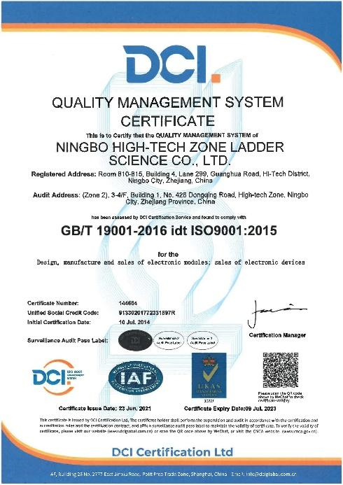
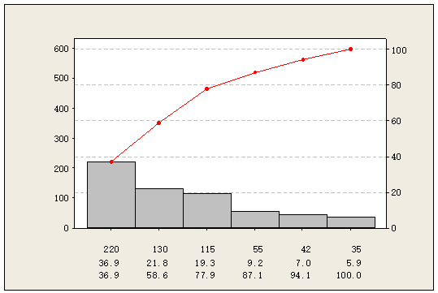
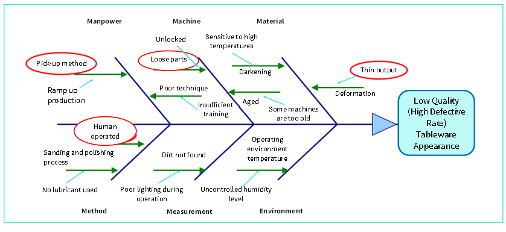
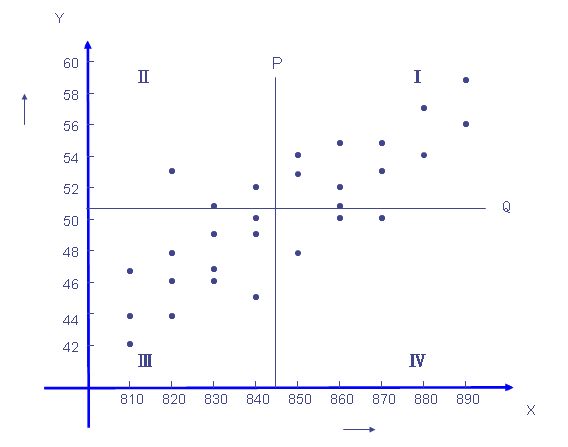
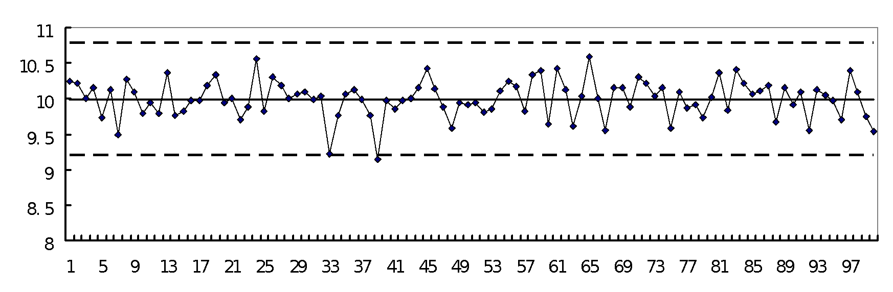

Quality Management System (QMS) is the management system that directs and controls an organization in terms of quality. Established within the organization, they are the systematic quality management models necessary for the said organization to achieve its quality objectives. The system can be considered to be one of the organization’s strategic measures. 
 
As the resources are being processed, quality management is done with a systematic and process-focused approach. Based on the organization’s structure, QMS will control the process management, supply chain, and product realization (from basic measurements, analysis, until improvement) processes. 

By definition, an organization’s QMS covers the **planning, implementation, monitoring, correction, and improvement activities of completing a client’s needs**. QMS will be operated during the designing and research processes, through production, inspection, sales up to delivery. Using the method of "doing what you say you’ll do and writing down what you did”, a QMS is an organization’s internal requirement for ensuring quality work. 

References: ISO 9001-2015 Standard Specification 

## Terms and Definitions for QMS

* **Quality**: the degree to which a set of inherent features satisfies the pre-designed requirements. 

* **Process Management**: a set of interrelated or interacting activities that transform inputs into outputs. 

* **Quality Control (QC)**: A product quality control can be divided into three stages: 
  * **Incoming Quality Control (IQC)** 
  This refers to inspection and confirmation of the quality of purchased raw materials, components or products (i.e. when a supplier sends raw materials or components, the product is sampled for inspection and judgment is passed on whether or not said batch will be kept or returned). 

  * **In Process Quality Control (IPQC)** 
  It's done to ensure that the goods being made by the Production Department meet necessary standards. This refers to checks that are done whenever a new batch of products is started or the production batch changes. 
  These inspections are primarily done for the purpose of monitoring and prevention, but they may also be done to ensure that items on the production line are being made to required tolerances. It means that, during official production, all products made will meet the quality requirements of the initial sample provided. Before IPQC is done, IQC is to confirm the quality of the incoming raw materials for the products which are going to be made. 

  * **Final Quality Control (FQC)**
  It refers to the inspection carried out before the products are shipped to ensure that the shipped products meet the customers’ requirements. 

* **Quality Assurance (QA)**
According to the international standards organization (ISO) this is "the assembly of all planned and systematic actions necessary to provide adequate confidence that a product, process, or service will satisfy given quality requirements.” 

* **Sampling plan**
A set of plans for the sampling process, including the number of samples and sample judgment guidelines. 

* **Acceptance Quality Level (AQL)**
It’s the worst level allowed when a continuous series of batches is submitted for quality check. AQL is widely used in various industries’ product quality inspection, and different AQL standards are used in the inspection of different substances. In the process of AQL sampling, the same quantities of samples are taken for the assessment.The smaller the AQL value is, the fewer defects are allowed, the higher the quality requirements are, and the stricter the inspection is.

* **5M1E (Man/Manpower, Machines, Materials, Methods, Measurements, and Environment)**
These are the 6 general factors which can lead to fluctuation in product quality. 

## Related standard systems

1. ISO 9001: "Quality management systems — Requirements"
2. ISO 9004: “Managing for the sustained success of an organization — A quality management approach”
3. ISO 14001: “Environmental management systems - Requirements with guidance for use”
4. OHSAS 18001: "Occupational Health and Safety Assessment Series — Scope"
5. ISO 22000: " Food safety management systems — Requirements"
6. HACCP: Hazard Analysis and Critical Control Point, Food Industry Safety and Hygiene Standards
7. TL9000: "Telecommunication Industry Quality Management System Standards"
8. AS9000: "Aerospace Basic Quality System Standard”
9. IATF16949: "Automobile Parts Production and Related Service Quality Management System Requirements" 

## ISO 9001 Overview of Quality System Documentation

In response to the demand for a standardized quality management system, the ISO (International Organization for Standardization)’s Technical Committee on Quality Management and Quality Assurance has developed the [ISO 9000](https://www.iso.org/iso-9001-quality-management.html) family of standards to apply to organizations dealing with products of different natures and sizes. 

The ISO 9000 family of standards is made up of a number of interrelated or complementary standards, including the well-known **ISO 9001 "Quality management systems — Requirements"**. ISO 9001 has proposed requirements that are complementary to the product requirements and has been revised several times. On the basis of this standard, different industries have developed corresponding technical specifications, such as IATF 16949 Particular Requirements for the Application of ISO 9001:2015 for Automotive Production and Relevant Service Parts Organization, and ISO 13485 Quality Management System for Medical Devices: Requirements for Regulatory Purposes. 

2015 Edition of Quality Management System: Quality Management Principles contains the following 7 aspects: 
1. **Customer-oriented**: The main focus of quality management is to meet customer requirements and strive to exceed their expectations;
2. **Role of leadership**: Leaders at all levels shall establish a unified purpose and direction and create the conditions for coworking to achieve the quality objectives of the organization;
3. **Full participation**: Competence, empowerment, and involvement of people at all levels throughout the organization are necessary for the organization to improve its ability to create and deliver value;
4. **Process approach**: When activities are managed systematically as interrelated, functionally coherent processes, the desired results can be achieved consistently in a more effective and efficient manner;
5. **Improvement**: Successful organizations are always committed to continuous improvement;
6. **Evidence-based decision making**: Decisions based on analysis and evaluation of data and information are more likely to produce desired outcomes.
7. **Relationship management**: To be consistently successful, organizations need to manage relationships with related parties such as suppliers. 

### NexPCB's QS Documents Framework
The hierarchy of ISO 9001 quality management system documents is as follows. but of course, this hierarchy is not unique and the documents can be separated or combined. The following is the framework of quality system documents adopted by NexPCB:

**1. First-order document: Quality Manual** 

A document describing the outline of the organization's quality policies, objectives, and system, generally including at least:
* Quality policies and goals.
* Organizational chart, and departmental responsibilities and authorities.
* The scope of the quality management system, including any details and justification for non-applicable aspects.
* The documented procedures prepared for the quality management system or references thereto.
* The description of the interactions between quality management system processes.
   
**2. Second-order document: Procedure Document** 

A procedure document is a document describing the step-by-step actions taken to implement the quality management system, which is an extended and more concrete version of the quality manual. It is made to ensure that the principles and systematic requirements in the quality manual can be developed and implemented. 
The procedure document defines specific approaches to perform quality activities, including: 
* The purposes and scopes of the actions.
* What to do, and who’s doing it. 
* When, where and how to do the action. 
* How to control and document the steps. 
* How to control risks and opportunities in the process.
* How to monitor the process performance. 

The following are the main second-order procedure documents of NexPCB: 

| Category                         | Procedure Documents Name                                        |
|----------------------------------|-----------------------------------------------------------------|
| Planning Documents               | Risk Control Procedure                                          |
|                                  | Quality Objective Management Procedure                          |
| Supporting Documents             | Equipment Management Procedure                                  |
|                                  | Tooling Management Procedure                                    |
|                                  | Management Procedure for Monitoring and Measurement Devices     |
|                                  | Knowledge Management Procedure                                  |
|                                  | Training Management Procedure                                   |
|                                  | Document Control and Management Procedure                       |
| Operating Documents              | Contract Management Procedure                                   |
|                                  | Customer Complaint Management Procedure                         |
|                                  | Design and Development Control Procedure                        |
|                                  | Supplier Management Procedure                                   |
|                                  | Purchasing Management Procedure                                 |
|                                  | Production Process Management Procedure                         |
|                                  | Product Delivery Management Procedure                           |
|                                  | Product Inspection and Control Procedure                        |
|                                  | Non-conforming Product Control Procedure                        |
| Performance Evaluation Documents | Customer Satisfaction Survey Control Procedure                  |
|                                  | Analysis and Evaluation Control Procedure                       |
|                                  | Audit Control Procedure for Internal Quality Management System  |
| Improvement Documents            | Corrective Action Control Procedure                             |
|                                  | Innovation Management Procedure                                 |

**3. Third-order documents: Operating Guidance** 

Operating documents define the routes of grassroots activities, including product inspections, specifications, guidelines, drawings, process documents, and forms. Operating documents also include procedure documents with lower levels and specific contents. 
Despite this, not every procedure document has a number of detailed guidance. Only when the procedure documents can’t meet the specific requirements of certain activities, it is necessary to prepare operating guidance. The specific requirements are made based on different products, services, processes, departments, or jobs. 

**4. Fourth-order documents: Records, etc.** 

Includes each of the procedure documents’ records which state points to be controlled in every step. 

NexPCB has passed ISO9001 certification since **July 10, 2014**, and has been focusing on quality system control to provide customers with quality-assured products. 

 

## Quality Process Control

There is an important guiding idea in ISO9001: all work should be done through process control, and the theory is described as **Input - Process - Output**. 

For example, the components and parts used to make a device are sourced with certain process parameters for production and manufacturing procedures until the product is qualified. Of course, each of the processes is not simple. Various constantly changing problems may arise throughout the process. 

Quality control refers to the operational techniques and actions undertaken to meet a specific set of quality requirements. The purpose of quality control is to **eliminate factors that may lead to non-conformity or unsatisfactory results at all stages of the quality loop by monitoring the quality formation process**. To meet quality requirements and obtain economic benefits, a variety of quality operation techniques and activities will be used. 

Nexpcb carries out quality process control throughout the whole process from supplier evaluation, introduction, procurement, delivery, IQC inspection, IPQC process inspection, and FQC final inspection to shipping using process methods in terms of quality control:

## Common Quality Tools

Nexpcb uses many practical quality tools when dealing with quality issues or performing daily quality management activities, such as: 

### I. Seven Major Measures for QC

**1. Checklist** 

The most important thing in quality control is to handle facts. To handle facts, you must use checklists to collect data.

* Record checklists: such checklists can be used to collect plan information and record the occurrence and data of a situation by making lines and points, which are often used in recording operations and quality conditions. 

e.g. Inspection Status Checklist 

| Operator | Machine number | Defective type | 5-1 | 5-2 | 5-3 | …… | Total |
|----------|----------------|----------------|----:|----:|----:|:--:|------:|
|     A    |        1       | Size           |   5 |   6 |   5 |    |    50 |
|          |                | Appearance     |  10 |   9 |  11 |    |   101 |
|          |                | Material       |   3 |   4 |   4 |    |    40 |
|          |                | Other          |   2 |   1 |   3 |    |    18 |
|          |        2       | Size           |   6 |   7 |   8 |    |    51 |
|          |                | Appearance     |   8 |   8 |   9 |    |   106 |
|          |                | Material       |   3 |   4 |   4 |    |    38 |
|          |                | Other          |   1 |   2 |   2 |    |    27 |
|     B    |                |                |     |     |     |    |       |
|          |                |                |     |     |     |    |       |

* Checklist for spot inspection
The checklist is used to confirm whether certain operations are completed in order to avoid any accidents (only records for yes/no or selection). In the checklist, the work or items should be listed and scored one by one. For example, the regular spot checklist for instrumentation and equipment

e.g. Spot Checklist for Machine

**Machine Number: R11**         
**Week: 24** 

|   No.   | Item	Date | 1 | 2 | 3 | 4 | 5 | 6 | 7 |
|:-------:|:--------:|----|--:|--:|--:|--:|--:|--:|
|    1    |     A    |  √  |   |   |   |   |   |   |
|    2    |     B    |  √  |   |   |   |   |   |   |
|    3    |     C    |  √  |   |   |   |   |   |   |
|    4    |     D    |  √  |   |   |   |   |   |   |
|    5    |     E    |  √  |   |   |   |   |   |   |
|    6    |     F    |  √  |   |   |   |   |   |   |
| Maintained by |    | CAC |   |   |   |   |   |   |
|  Reviewed by  |    | BTC |   |   |   |   |   |   | 

√: Good         
X: Abnormal 

**2. Pareto chart** 

In 1897, the Italian scholar Pareto analyzed the socio-economic structure and found that the majority of wealth was in the hands of a very small number of people, known as "Pareto's Law". Dr. Juran, an American quality expert, applied it to quality control and created the term "Vital Few, Trivial Many", which is called the "Pareto principle". 

In quality management, there are many reasons for the occurrence of defects, but there are only 1~3 items with significant impact. As long as these key points are identified, it will be easy to obtain solutions and realize improvements. 

 
**3. Fishbone diagram** 

It is also known as the **Cause & Effect diagram**, which was first used in 1952 by Dr. Kaoru Ishikawa, an authoritative scholar on quality control in Japan, to clarify the relationship between cause and effect, also known as the **Ishikawa diagram**. 

A cause & effect analysis chart is usually made by several people through brainstorming. Of course, it can also be done by one person, but the pool of ideas might not be that broad. 

The causes generally include manpower, machine, material, method, measurement and environment **(5M1E)**.

 

**4. Histogram**
A graph in which the relative frequencies of different levels of a variable are plotted in rectangular blocks using a normal distribution. The histogram can reflect the distribution of product quality by processing the seemingly disordered data collected to judge and predict product quality and failure rates. 

It can be used to:
* Verify the process capability as a basis for process improvement.
* Check the normality of the data distribution.
* Grasp the status of the process through the fluctuation of quality data to determine where improvements can be made. 

 

**5. Scatter diagram** 

It is also called a correlation diagram, in which two pairs of data are collected to study the correlation between two variables, and the correlation between the values of the two characteristics is represented as points on a square grid and coordinate system. 

It can be used to discover, display and confirm the type and degree of correlation between two sets of related data and to confirm the expected relationship between them. 

 

**6. Control chart** 

It is a statistically designed chart used to measure and record various characteristic values of a process to evaluate and monitor whether the process is under control. When control charts are used, they can be divided into the following two types:
* Analysis control charts that are mainly used to check if a process is under control. 
* Management control charts that are used to maintain statistical control.  

 

**7. Stratification diagram** 

The establishment of a method or condition that separates the matrices in order to distinguish the effects of various features of the collected data on the results is called stratification. There are different stratification perspectives:
* Stratification of time, such as by hours, days, weeks, and months.
* Stratification by operators.
* Stratification by machines and equipment.
* Stratification by operating conditions.
* Stratification by raw materials (e.g., different suppliers or different batches).
* and other stratification processes that will be set based on the on-site situation.

e.g.  XXX Shooting Survey Form (by operators)

| Operators | Number of misses | Number of hits | Incidence |
|:---------:|:----------------:|:--------------:|:---------:|
|     A     |         6        |       13       |    0.32   |
|     B     |         3        |       16       |    0.25   |
|     C     |        10        |        9       |    0.53   |
|   Total   |        19        |       31       |    0.38   |

### II. Five Major Improvement Tools

The following tools are more advanced for quality analysis and are often used in the automotive industry. Nexpcb may use them in dealing with some complex conditions: 

* **Measurement System Analysis (MSA)**         
The MSA combines 3 separate features: mathematical statistics, statistical variance analysis, and the study of the influencing factors that make up the measurement system. These assessments are performed to obtain conclusions about the accuracy and reliability of the measurement system. The quality of a measurement system usually depends only on the statistical characteristics of the data produced over time, including Bias, Repeatability, Reproducibility, Linearity and Stability. 

* **Failure Mode and Effects Analysis (FMEA)**         
This is an analysis method used to identify potential failure modes and their causes. It allows the analysis and evaluation of various possible risks, along with the improvement of product design and production processes based on the magnitudes of the risks.

* **Design Failure Mode and Effect Analysis (DFMEA)**          
It is a method used to control product quality during the design stage. The tool also acts as a control tool used to maintain product quality for formal production and delivery to customers during the design and development stage. 

* **Process Failure Mode and Effect Analysis (PFMEA)**         
It is a tool used to prevent potential failures in terms of processes during the mold design phase, the trial mold and trial production phases, the pre-mass production phase, and the customer complaint phase for new parts. 

* **Statistical Process Control (SPC)**         
It is a statistics-based quality management technique used to evaluate and monitor the various stages of the process. SPC is done to establish and maintain an acceptable and stable level of the process, thus ensuring that products and services could meet the specified requirements. The output of the process is then tested and judged by graphical and statistical methods to predict whether the output could meet customer requirements. This can be done with the help of specialized software and other tools, such as Minitab.         
For instance,
  * The stability of the process operation can be determined by a statistical tool, i.e. the control chart. 

  * The adequacy of the process capability can be achieved by Process capability analysis. 

* **Production Part Approval Process (PPAP)**         
PPAP is used to determine whether all requirements of the customer's engineering design records  and specifications have been properly understood and whether the production process has the potential capability to meet customer requirements in the actual production at the specified production rate. It is mainly used in the automotive industry. 

* **Advanced Product Quality Planning (APQP)**         
It is a process used to identify and develop the steps needed to ensure that a product satisfies the customer's Structured Approach. The goal is to facilitate contact with each party involved to ensure that the required steps can be completed on time. Effective product quality planning relies on the senior management's commitment to strive to achieve customer satisfaction. Product quality planning is a structured approach that is primarily used in the automotive industry. 

### III. Quality Improvement Tools:
Various quality tools can be used by the persons in charge to analyze and study occuring problems for improvement, such as by using the quality control cycles shown below. 

* **Quality Control Circle (QCC)**         
A small circle formed by a group of people (generally around 6 people) from the same, similar or complementary workplaces spontaneously to cooperate and pool their ideas to solve problems and issues that occur in terms of workplace, management and culture by following certain activity procedures and using tools such as the Seven QC Measures. It is a vivid form of quality control. 

* **Six Sigma**         
Six Sigma, also known as 6 Sigma, is a management strategy that focuses on quality management and was introduced by Motorola in 1986. This strategy emphasizes setting extremely high goals, collecting data, and analyzing results to reduce defects in products and services. The principle behind Six Sigma is that if you can detect defects in your project, you should figure out how to systematically reduce them and make your project as perfect as possible. For a company to meet Six Sigma standards, its error rate cannot exceed 3.4 parts per million units.

### IV. Reliability Testing

Reliability is an important indicator of product quality and is an inherent property of a system like the capacity or power rating of the system. Nexpcb focuses on the reliability of its products by conducting it from the S1 stage throughout the lifecycle of the products. In the early stage of product development, i.e. the S1 ~ S3 stages, Nexpcb will focus on the properties and use requirements of products or materials for reliability testing. Nexpcb will design reliability testing plans uniquely based on each situation, and carry out reliability certification through SGS, CTI, and other professional institutions if necessary.

Common reliability plans: 

**Mechanical reliability:**

* **Mechanical fatigue test**: The test is to simulate the use environment of a product or material and test its fatigue strength.

* **Tensile test**: It is a tensile test for products, materials, and processes, which will simulate the tensile conditions that may occur during the use of the product.

* **Bending test**: The purpose of the test is to determine the mechanical properties of a material when it is subject to a bending load, and it is one of the basic methods for testing the mechanical properties of materials. In a bending test, one side of the specimen will be subject to a one-way tensile force while the other side subject to a one-way compression force with the maximum positive stress on the surface of the specimen, which is sensitive to surface defects. Therefore, the bending test is often used to test the material surface defects such as carbonization or surface quenching layer quality. In addition, for brittle materials that are sensitive to eccentricity, it is not easy to use a tensile test to accurately determine the mechanical properties of the materials. Therefore, the bending test is commonly used to determine the flexural strength and relative comparison of the deformation capacity of the materials.

* **Mechanical shock test**: Electronic equipment may be subject to mechanical shocks in production, transportation, and even application. The mechanical shock test simulates the impact generated during such processes to test the ability of a product to withstand the shocks. Reference standards include: GB/T 2423.5-2019/IEC 60068-2-27:2008, GJB 150.18A-2009, GJB 367A－2001, GJB 322A-1998, GJB 3947A-2009, GB/T 6587-2012, GJB 548B-2005, and GJB 360B-2009.

* **Drop test**: The drop test is to simulate the drop of a packaged product on its edges, corners, and surfaces at different heights to the ground, to identify potential damage to the product. It’s also used to evaluate the height and impact strength of the product packaging components that can withstand after drop. This way, the package designs could be improved according to the actual conditions of products within the national standard scope.

* **Vibration test**: This test can simulate various conditions that may be encountered during manufacturing, assembly, transportation, and application to verify the ability of the products to withstand vibrations. It is applicable to the research, development, quality management, and manufacturing in various industries such as electronics, mechanical products, electrical products, automobile parts, and toys. 

**Environmental reliability test:**

* **Temperature cycle aging**: This process is to simulate the aging of a product or material in use, so as to eliminate the machining stress generated in production. For example, the method is to maintain a product at a high temperature and a low temperature from -40 to 85 ℃ for 30 minutes each for 10 cycles, to effectively relieve mechanical stress generated by machining.

* **High-temperature aging**: A test in which a product or material will be exposed to high temperatures and dry air. As the most commonly used test, it can be used for component and machine screening, aging tests, shelflife tests, accelerated life tests, and evaluation tests and it also plays an important role in the verification of failure analysis. In the process of high-temperature tests, extra attention should be given to the maximum withstand temperature limits of products and components. When the sample is put into the test box to maintain its heating uniformity, the gap between the sample and any wall of the box shall be at least 5cm. After the test, the sample shall be recovered to a stable state in the box, or be placed in an environment at normal temperature and humidity to recover to a stable state. Please refer to GJB150.3-86.

* **Low-temperature storage aging**: It is a simulation test used to verify the reliability of a product or sub-material stored at low temperatures. The product is stored at a low temperature of -40 ℃ for 168 hours (the temperature can be determined based on actual test conditions) before the conventional performance test. Please refer to GJB150.4-86 Environmental Test Methods for Military Equipment: Low-Temperature Test.

* **Temperature shock test**: The test can be used to test the ability of a material to  withstand an **instant change** in temperature. It is applicable to electronic products, semiconductors, electronic circuit boards, metal materials, bearings, and other components which are exposed to or will undergo rapidly changing temperatures.         
The test can be done by immediately transferring a componentl from the high-temperature chamber (RT: 150 ℃) to the low-temperature chamber (RT ~ -40 ℃) after it is kept in the chamber for a period of time. This component will then be transferred from the low-temperature chamber back to the high-temperature chamber after a said period. The process will be carried out within a certain number of cycles. 
These test requirements are different for different industries or manufacturers in accordance with the standard test method above. The reference standards of temperature shock boxes are GB/T2423.1.2, GB/T2423.2, GB10592, GJB150.3, GJB150.4, and others. 

* **Salt spray test**: It is an environmental test using artificial salt spray to assess the corrosion resistance of products or metal materials. The salt sprays could be divided into neutral salt spray, acidic salt spray, copper ion spray, cyclic salt spray, etc. The referred standard documents are GB/T 2423.17, IEC60068-2-11, ISO4628-3, ASTM B117, JIS-Z2371, JIS-G3141, GJB 150.11A-2009, MIL-STD-810F, MIL-STD-883E and other domestic or international standards.

* **Dustproof and waterproof test**: It's a test for products with dustproof and waterproof requirements. Please refer to GB/T 4208-2017 Enclosure protection level (IP code) for the highest level of dust and water resistance. The purpose of the test is to evaluate the performance of the shell in resisting solids and water.         
The XX of IPXX shall be mainly checked with the first X representing dustproof level from 0 to 6 (top) and the second X representing waterproof level from 0 to 8 (top). Nexpcb will carry out this test from stage S1 to stage S3 of a product based on materials and processing properties.

* **High temperature and high humidity test**: The test is to simulate the high temperature and high humidity conditions. The simulation environment has a temperature of 85 ℃ and humidity of + 85%. Nexpcb will conduct this reliability test in the pre-development stage together with the water and dust resistance test.

* **UV aging test**: The test is to simulate the aging of the product in outdoor conditions under UV radiation. Common reference standards include ISO 4892-1, ASTM G-151, ASTM G-154, BS 2782-5, and SAE J2020 JISD 0205.

