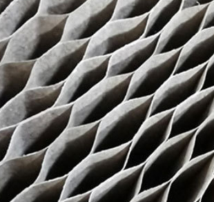
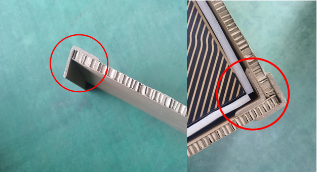
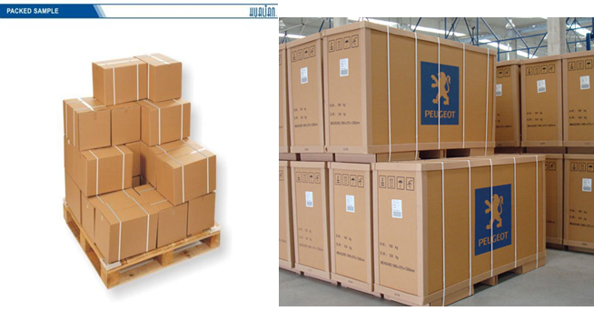
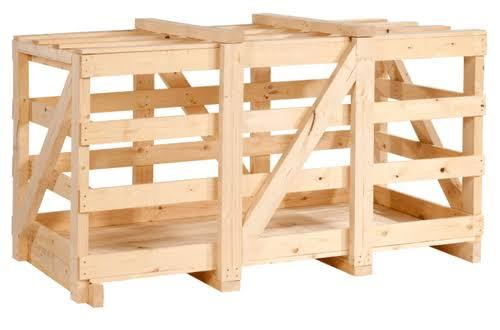
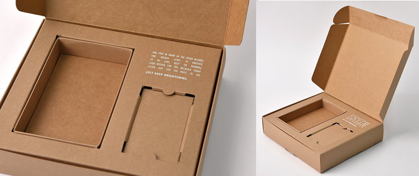
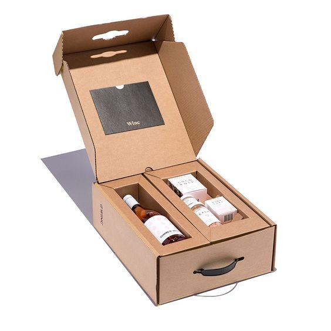
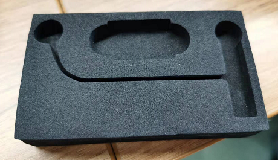

Structural reinforcement refers to the materials added to strengthen the product structure to meet the new requirements of use and safety, and to save costs and reduce investment. 

Product reinforcement is used to protect the integrity of the appearance and functions of the product. It can even protect the surface of the product packaging under certain conditions. In the case of long-distance transport, we certainly need extra structural reinforcements to keep our products protected. We will not let our countless days and nights of hard work be in vain, nor will we let our customers' expectations come to nothing. 

To do so, every product will be protected based on its individual characteristics. Some products need “soft protection” (such as **bubble wraps, shielding bags, and anti-static foam**), while others need “hard protection” - structural reinforcement (such as **EVA foam, carton with integrated folding liner, and blister tray**). 

Without structural reinforcement, the products will run around in the packaged box and collide with each other, and there’d be a huge risk of overweight products falling apart during the transportation process. 

Looking into the structural reinforcements or “hard protection” materials mentioned above, the EVA foam is one of the most commonly used one. EVA foams are sturdy, are relatively more costly than the other materials. Cartons on the other hand, are more cost efficient and hence are used as a cheaper alternative. 

PUrchasing a single reinforcement material might seem like it's a large budge to assign to. However, keep in mind that the materials are going to be used for the whole batch, and are to be used by several products. Hence, the cost for structural reinforcement for each product will be small. 

Time requirements:
Custom slotted EVA foam: 10-15 days
Custom slotted cardboard: 7-10 days

Who will take care of that?
Pre-design and packaging solutions: packaging designed by Ophelia
Intermediate process: order placed by personnel from the purchasing department
Final stage: assembly by workshop staff
We will communicate in advance, for example 1. For EA, we have a default packaging method. The customer will specify the packaging method to the PM, who will then convey it to me. 2. The customer for the Alxedo project would not know what packaging method to use. I would make the proposal first and then show it to the PM who would communicate and determine if the customer agreed to adopt it.

# Common methods for Structural Reinforcement:

## Shock-resistant materials are used to enhance structural stability
### Honeycomb cardboards 
The honeycomb cardboard was constructed to follow the structure of natural honeycombs. Honeycombs are lightweight but strong. This is due to the unique continuous hexagonal layers in the structure. Honeycomb cardboard is a rigid, compact composite material with good thermal and sound insulation. Honeycomb cardboard is usually used as a shock absorber since it suppresses vibration well. This reduces the breakage rate during transportation and its application might also replace wooden boxes. 

## Adding parts to enhance structural stability
### Paper edge boards
Paper edge boards are lightweight and small structures to assist the product’s protection against both compression and moisture. They improve the packaging quality for transportation, enhance the stacking strength of the carton, protect products from damaged outer packaging and effectively protect the edges and corners of the products. 

 

Other types of edge boards: 

### PP packing strap  
As one of the light plastic strap, the PP packing strap is mainly made of polypropylene drawing grade resin, featuring good plasticity, strong fracture tension, high bending fatigue resistance, low density, low value of specific gravity, good tensile impact performance, and are easy to use. These PP packing straps could be either translucent or opaque. 

 

Use of packing strap: 

 

### Wooden frames  
Wooden frames are easy to make. They are strong materials with good durability, elasticity, shock and vibration resistance, and are relatively low in cost.
Wooden frames provide excellent protection for products in long-distance transportation and are usually recovered for re-use. 

 

## Using lining members to enhance structural stability
### Carton with internally folded liner  
The internally folded liner is made up of a gray board as the frame and covered with coated paper or other paper, with a gap at the bending of the gray board. The whole paper carton can be folded to form a three-dimensional shape for utilization. It can be folded freely and shaped beautifully to reduce the cost of packaging and logistics. 

 

 

### Specially shaped cartons for component placement
To place objects, unique chambers are often made in the inner layer of the box. The structure provides cushioning of the product, avoiding issues such as poor environmental protection and poor recycling performances of external cushioning materials. Since no cushioning material is needed, the packing process will be much simpler and more effective. The process of recycling these packing materials will be more convenient. 

### EVA foam slot  
Eva foam slot has numerous advantages, including waterproof, corrosion resistance, antibacterial, non-toxic, odor-free, non-polluting, strong and flexible, good shock resistance and buffer performance, also excellent heat and sound insulation capabilities. They are also easy to process: cutting, stamping, pressing, splitting, molding, gluing, fitting, padding, and other processes can be done with ease. 

### Blister tray  
It is also called a blister inner tray. The blister process is used to make the plastic hard sheet into specific grooves. The products can be placed in the grooves for protection and aesthetics. There are also tray packages for transport with thicknesses not more than 1.55 mm. They are usually made up of plastic, such as PVC, PET, PP, PS and flocking sheets, gold-plated sheets, and anti-static sheets.

 

The overall process of prototyping to mass production and delivery:

