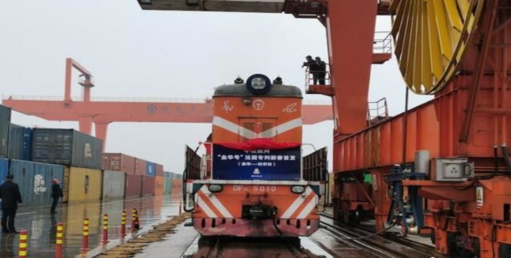
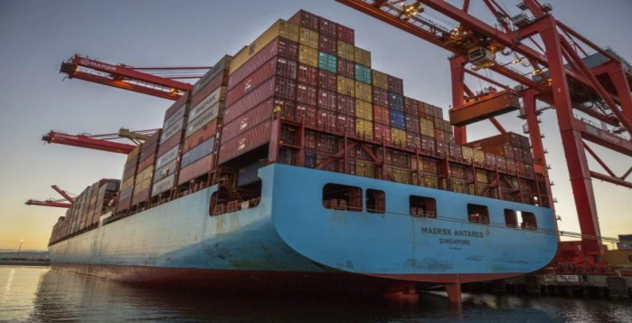
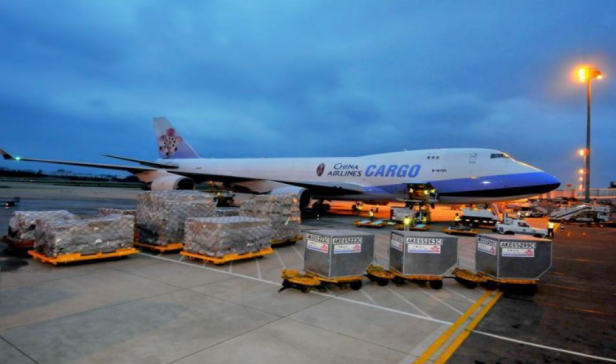
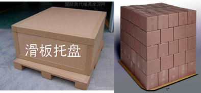

## Introduction
The modes of transport are defined as the transport forms created by the application of various carriers and routes under different management. To put it bluntly, it means how a commodity gets from the place of origin to the destination through various mediums and routes. In choosing the different modes of transport, many factors such as the specificity of the commodity, timeliness, and control of transport costs should be first considered. 

Accounting for a large proportion of the total cost of logistics, the transport cost is a dominant one therein. As different transport modes may lead to different logistic costs, it is essential to choose a proper transport mode. What exactly are the transport modes? What are their respective strengths and weaknesses? 

## Influencing factors
The transport system is made up of several factors, which include: the type and nature of the carriers, transport routes, also the ports or stations that are used or involved. The selection of the modes of transport to be used is firstly based on the factors mentioned. Other than those, the transport process is also  affected by the weather, the presence of equipment and other facilities, as well as the main technical and economic indicators. 

## Classification

In general, NexPCB classifies our transport modes into five, including highway, railway, waterway, aviation, and pipeline. 

* **Highway transport** 

Highway transport is a mode of transport where cars and other vehicles like human- or animal-drawn carts are used to carry goods along the highway. It mainly serves short-distance freight transport and small quantities of cargoes, which runs for long distances and carries large quantities towards areas that are not readily accessible for waterway and railway transports. Its leading advantages include its high flexibility, the short construction period of highways, relatively lower cost of transport, easier response to error, moderate requirements in facilities of the destination, and an option for “door to door” transport. Highway transport can be used as means to link different transport modes, and usually covers distances less than 200 kilometers. 

* **Railway transport** 

Railway transport is defined as a mode of transport where trains are used to carry goods. It mainly serves freight of long distances and large quantities of goods. In areas where water transport is not available, almost all bulk goods rely on railway transport, causing them to play a major role in trunk line transportation. Its economical distance is usually above 200 kilometers. 

* **Water transport** 

Water transport is defined as a mode of transport where ships are used to carry goods, which mainly serves transport of large quantities and long distances, and plays a major part in the trunk line transportation. On inland rivers and along coastlines, water transport also usually serves as a small-scale transport mode, supplementing and linking trunk line transportation for bulk goods.  

 

* **Air transport** 

  Air transport is defined as a type of transport mode where planes or other airborne transports are used to carry goods. Most of the time, it is suitable for the following three types of goods: 
  1. Valuable and transport-friendly goods such as components of expensive equipment and high-grade products. 
  2. Emergency supplies such as disaster relief materials. 
  3. Fresh, perishable and seasonable goods. 

  In actual logistics operations, three major modes usually adopted are as follows: 

  * Airliner transport: defined as airplane transport with a fixed schedule, fixed route, and fixed airport of departure and destination, suitable for the transport of emergency goods, and fresh and seasonable products.
  * Chartered carrier transport: defined as an airplane chartered by a single or several consignor(s). It can then be further categorized into a wholly-chartered plane and a partially-chartered one. The former is suitable for transporting large quantities of goods, while the latter is for transportation of goods with several consignors and the same destination airport.
  *  Consolidation transport: defined as the process where an air freight forwarder combines several goods to be shipped towards the same destination into one batch. This is done by handling one mater air waybill with the airline company. After arriving at the arrival airport, the combined goods are received and declared at the customs by the agent authorized by the aforesaid forwarder. The goods are then distributed to each actual consignee according to the address stated in the issued air waybill by the forwarder. Consolidation is one of the most popular transport modes used by air freight, and also one of the primary services of air freight forwarding.  

  

* **Pipeline transport** 

Pipeline transport is a mode of transport where pipelines are used to carry gases, liquids, and solid slurries. It is achieved by moving objects along the pipeline in the direction of high to low pressure. What sets pipeline transport apart from the other modes of transport is the stationary setup of pipeline transport equipment. 

 

## Comparison 

**Comparison of advantages and disadvantages of various transport modes** 

| Transport mode     	|                                                                                                                                                                                             Advantages                                                                                                                                                                                            	|                                                                                                         Disadvantages                                                                                                         	|
|--------------------	|:-------------------------------------------------------------------------------------------------------------------------------------------------------------------------------------------------------------------------------------------------------------------------------------------------------------------------------------------------------------------------------------------------:	|:-----------------------------------------------------------------------------------------------------------------------------------------------------------------------------------------------------------------------------:	|
| Highway transport  	| Direct door-to-door transport is possible. Economical for short-distance transport. Flexible, able to meet different needs.                                                                                                                                                                                                                                                                       	| Small capacity of each vehicle, not suitable for large quantities. Expensive in the case of long-distance transport.                                                                                                          	|
| Railway transport  	| Meet the need of efficiently transporting large quantities of goods in one go. Economical when transporting goods that cannot afford high freight charges. Less accident occurrence and provide more safety since tracks are used.  Generally, the railway transport network is complete, allowing the delivery of goods to various destinations. Hardly affected by the weather during transport 	| Expensive in the case of short-distance transport. Not suitable for emergency transport. In the case of long-distance transport, the train may stop for a long time on route due to cargo arrangements.                       	|
| Water transport    	| Suitable for large quantities of goods, which cannot afford high freight charges. Suitable for freight with a large volume/weight.                                                                                                                                                                                                                                                                	| Slower (longer duration of transport). Higher handling fees at harbors. Heavily affected by the weather. Poor accuracy and safety of transport                                                                                	|
| Air transport      	| Fast in transport speed. Suitable for long-distance transport of small quantities of goods, which can afford high freight charges.                                                                                                                                                                                                                                                                	| The high freight charge and low transport capacity are not suitable for the transport of goods with low value or those in large quantities. Limited weight and volume of the goods. Not applicable for areas with no airport. 	|
| Pipeline transport 	| High efficiency. Suitable for the transport of gaseous and liquid goods. Uses less land. Suitable for automated management thanks to its high efficiency.                                                                                                                                                                                                                                         	| Stringent requirements in objects to be transported                                                                                                                                                                           	| 

## Others

As the transport industry evolves, more advanced transport modes, apart from the five basic ones, have been developed. These additions of transport options have greatly enhanced transport efficiency and reduced transport costs. 

* **Pallet Transport** 

  A pallet works as a horizontal platform unit on which goods are placed. Pallets are used for collecting, distributing, storing, moving, and transporting goods. Bulks of goods are placed onto such platform and bundled as required to create a transport unit, to ease the process of mechanical loading/unloading, handling, and stacking amid transport.
  Pallets are usually made of wood, plastic, glass fiber, or metals. A pallet can be added with upper fittings, which fall into the most common three types based on their structures:

  * Flat pallet -- made up of two- or single-layer board(s) with base supports.         
     

  * Box pallet -- a flat pallet serves as the base, on which a box-like structure is installed, enclosed by mesh or ordinary board, with or without cover at the top.        
     

  * Post pallet -- It has a flat pallet as the base, a pole at each corner, and a mobile tracker at either transverse side, through which the length or height can be adjusted when putting goods onto the pallet.        
      

  * Sliding pallet -- mainly divided into pallets with plastic or paper sliding devices.           
      

  |                            Advantages                            	|                                                                                Limitations                                                                                	|
  |:----------------------------------------------------------------:	|:-------------------------------------------------------------------------------------------------------------------------------------------------------------------------:	|
  | Shorter transport time and less labor intensity                  	| Limited scope of the goods to be transported. Good for small-sized, boxed or carton-packaged goods. Not suitable for large-sized, irregular-shaped, or bulk frozen goods. 	|
  | Eases counting and handing over, reducing cargo loss or damages. 	| Increased pallet costs with a corresponding reduction in carrier capacity                                                                                                 	|
  | Small investment for instant results.                            	| Failing to serve the requirements of international multimodal transport                                                                                                   	|

  **Specifications and dimensions of pallets** 

  The International Organization for Standardization (ISO) specifies four types of pallet specifications as follows:      
  * 1200mm*1000mm, rectangular, widely used in Europe. 
  * 1200mm*800mm, rectangular, widely used in Europe. 
  * 1140mm*1140mm, square, widely used in Australia. 
  * 40” (1016mm) *48” (1219mm), rectangular, widely used in the USA.  
 
  The size 1200mm x 1000mm pallet is the most common type to be used around the globe. This is also the most common one in China.    
  In Asia, square pallets of the size 1100mm x 1100mm are also frequently used.        

* **Container Transport**

Container is a mode of transport that makes up bulk cargo, sundry cargo, and other special cargo. Container transport is one of the modern transport modes where containers serve as units to transport goods. It suits waterway, railway, multimodal transports, etc., with following advantages and disadvantages: 

|                                          Advantages                                          	|                                              Limitations                                              	|
|:--------------------------------------------------------------------------------------------:	|:-----------------------------------------------------------------------------------------------------:	|
| It enhances the quality of transport and reduces the risk of freight loss and damage.        	| Big dead weight leads to a big proportion of ineffective transport and loading/unloading.             	|
| Reduces various fees and freight costs.                                                      	| The high cost of containers would be apportioned to each transport in logistics.                      	|
| It improves efficiency in loading/unloading and accelerates the turnover of transport means. 	| Container empty returns may build up transport costs of unit goods, and bring down their utilization. 	|
| It simplifies freight procedures and facilitates the transportation of goods.                	|                                                                                                       	| 

* **Multimodal Transport**

Multimodal transport means the carriage of goods by at least two different modes of transport on the basis of a contract from a place in one country at which the goods are taken. The process is managed by the multimodal transport operator to a place designated for delivery, situated in a different country. For example, sea-land transport, sea-rail transport, sea-air transport, air-land transport, sea-rail-land transport, etc.  

## FAQs

Choice of couriers provided by NexPCB: 

**S. F. Express**: falls into highway (land) transport and air transport, somewhat varying in the price and time limit.          
**I07**: multimodal transport -- goods are transported via highway to Shanghai, and then shifted to water transport, namely, they are shipped via sea to a port in USA, and then transported via highway to customer’s warehouses; I07 also offers value-added services -- pallet transport -- flat pallet.          
**Beeper transport in batches**: multimodal transport -- beepers are transported via highway to Shanghai, and then shifted to water or air transport to a port in the USA, and then transported via highway to customer’s warehouses.        
**International express**: multimodal transport -- goods are transported via highway to Shanghai for customs clearance, then shifted to air transport to a nearby city in the destination country, and are transported via inland highway to customers.  

**Q**: There’s a small international parcel that the customer needs urgently, and what is the fastest way to make it? 

**A**: How much is the value? Do you need to declare at the customs? What is the name of the goods? Does it contain lithium batteries or liquids or magnets?
* A customs declaration within USD600 can be done quickly. Otherwise, a formal declaration is required and it will take one to two working days.
* If the product has ever been declared before, the template can be used. Otherwise, the process of financial tax refund filing should be considered, and a report shall be made in advance.
* For a product with lithium batteries, certificates shall be handled for direct transport. Otherwise, it needs to be forwarded via a freight forwarder in Hong Kong.
* For products with magnets, extra inspection is needed, which would take a longer time.
* For products with liquids, a confirmation shall be made with agents in advance to make sure whether such product can be transported.
* For all these issues involving transport cost and time, a comprehensive consideration is needed. Both our PM and Sales can assist you with it. 
  

**Q**: What is the weight range suitable for air freight? Since express delivery is similar to air freight, what is the difference between them? 

**A**: Generally, air freight is considered for a charged weight of over 100 kilograms, since 100 kilograms is the starting weight for charging for air freight. 
The differences between express delivery and air freight lie in:
* Different service locations: express offers door to door service, while air freight transports goods from one airport to another
* Different procedure handling: easier handling for express since you only need to fill out a waybill and enclose the invoice. Airfreight handling is more complicated, as you need to handle a whole package of paperwork for customs declaration, including guarantee letters for non-hazardous goods and declaration.
* Different volume requirements: small parcels are suitable for express, while large-sized goods are for air freight. 
* Different duration: they both take basically the same time, sometimes express is faster, and sometimes air freight is quicker, depending on each case.
* Different service facilitation: for express, you merely need to make an appointment, and your parcels would be directly collected. For airfreight on the FOB basis, you need to transport your goods to and unload them at an appointed warehouse. However, under EXW terms, you and your agent need to reach a consensus over the time of picking up goods, and then the agent arranges a driver to pick up such goods from the supplier’s warehouse.

**Q**: How does the whole transport system work? Can you show us the steps? 

**A**: Taking the example of the transport process using our international express delivery:
1. Waybills and export declaration documents made by the exporter.  
1. Pickup is scheduled.  
1. Handing over of goods. 
1. Export declaration.  
5. Goods leave through ShangHai. 
6. Forwarding between airports and ports. 
7. Goods arriving at the destinated country.  
8. Forwarding to destinated city.  
9. Arrival at destinated city's port. 
10. Import customs clearance and duty payment. 
11. Forwarding and delivery. 
12. Importer signing delivery letters when goods are received.

In short: **delivery -- export declaration -- import clearance -- delivery**. 

In this case, the fees charged vary according to different weights and different packages. For transport, the Sales and PM on our team need to communicate with the logistics operator of the partner. 
