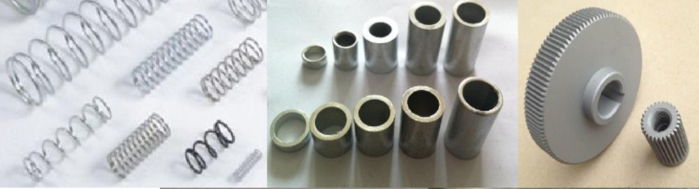
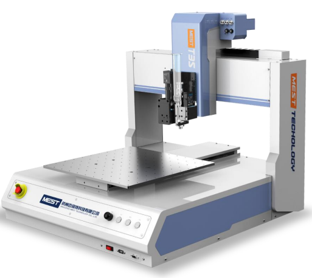
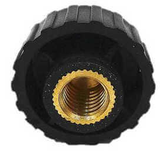

The process of assembly is continuously being evolved with the aim to improve the quality and speed of production. In the early stage of the development of the machinery manufacturing industry, operations such as filing, grinding, scraping, hammering and tightening screws were used for assembly to make parts fit and connect. In 1789, Eli Whitney from the US had manufactured 10,000 muskets with interchangeable parts, relying on special fixtures to enable unskilled child laborers to engage in assembly work, greatly shortening the working hours. In the early to mid-19th century, interchangeable assemblies were gradually extended to products such as clocks, small arms, textile machinery, and sewing machines. At the same time as the development of interchangeable assembly, the term assembly line was also developed, and then by the beginning of the 20th century, a relatively complete automobile assembly line appeared. Following all these developments, the process of automated assembly that we use now was also developed. 

### General Assembly Terms

A product is made up of numerous parts and components being combined together. The labor process of **joining several parts into a component** or **joining several parts and components into a product** is called assembly. The former is called component assembly and the latter is called general assembly. 

1.	Components are the most basic units that make up machinery and participate in assembly.

2.	Most components are pre-assembled into modules, subassemblies, and smaller parts before entering higher-level assembly units. 
 
3.	A module is an assembly unit that is one level larger than a part. The following cases are all combinations: 
    * Two or more parts are joined together by non-detachable joining methods (such as riveting, welding, hot pressing assembly, etc.).
    * After a few parts are combined, they need to be combined and processed, such as the gear reduction box and the cover, the diesel engine connecting rod and the connecting rod cover, all of which are combined after the boring, and the parts are seated according to the number and cannot be interchanged.
    * Group together with a datum part and a few parts. 

4.	A part is a combination of one or more components and several modules. 

5.	A subassembly is made up of a reference part and several components, modules, and parts. Such as spindle box, tool box, etc. 

6.	An assembly (general assembly) is a relatively larger integration than the component concept, a device with a complex mechanism, usually containing several assemblies, such as an excavator, with a chassis assembly, a main engine box assembly, Arm working mechanism assembly, hydraulic power system assembly. 

7.	Generally speaking, the final assembly is greater than or equal to the assembly, depending on how complicated the equipment is. If the assembly needs to be expressed at a higher level, it can be reflected in the final assembly. The final assembly reflects the significance of the whole machine. 

### Method of Assembly
The method of assembly includes the steps and sequences, technical requirements, and inspection methods conducted on the parts and components done during the assembly process. These processes should be documented along with the selection of machineries and fixtures, the time taken, and quota required for the whole assembly process. 
There are 4 types of assembly methods: interchange assembly, group assembly, repair, and adjustment.

1. Interchangeable assembly 

In the interchangeable assembly method, the assembly accuracy mainly depends on the manufacturing accuracy of the parts. According to the degree of interchangeability of parts, it can be divided into complete interchange assembly and statistical interchange assembly.

*  Completely interchangeable assembly method                               
The completely interchangeable assembly method is suitable for assembling mechanical structures with a small number of rings or with low assembly accuracy requirements in batch production and mass production. The advantages are stable and reliable quality, simple assembly process, high assembly efficiency, easy to realize automatic assembly, and convenient product maintenance. 

* Statistical interchange assembly method (Incomplete Interchangeable assembly method)                                            
Compared with the complete interchangeable assembly method, the incomplete interchangeable assembly method has the advantage that the tolerance of the parts can be enlarged, so that the parts are easy to process, the cost is low, and the purpose of interchangeable assembly can also be achieved. The disadvantage is that the assembly accuracy of some products will be out of tolerance. This requires remedial action or economic justification. 

### Plastics Assembly

1. **Fastener connection** 

Fastener connection refers to the application of fasteners to connect plastic parts, including press-in fasteners, self-tapping screws and bolt connections. Commonly referred to as a press-in fastener, a plastic piece is connected by some kind of protrusion on its stem that forms an interference fit with the plastic cavity. Self-tapping screws use self-tapping threaded connections.
 
2.	**Adhesive connection** 

The adherends are held together by the adhesion of glue. Commonly used glues are instant glue, UV glue, hot melt glue, silica gel and so on. By applying different glues, to achieve different requirements for products, such as strength, waterproof, sealing, chemical resistance, beautiful appearance, etc.                                
With the rapid development of automation technology, manual dispensing has been far from meeting the needs of the industry and has been gradually replaced by automatic dispensing machines. Automatic dispensing machines are widely used in industrial production, such as integrated circuits, printed circuit boards, electronic components , auto parts, handbags, packaging boxes, etc. The application of automatic glue dispenser greatly improves production efficiency, improves product quality and uniformity, and can realize some processes that cannot be completed by manual glue dispensing.                                     
NexPCB has been equipped with an automatic glue dispenser with a reliable production standard. 

 
3.	**Snap connection** 

Snap connection is a mechanism used for embedded connection or integral locking of one part and another part, usually used for the connection of plastic parts, and its material is usually composed of plastic material with certain flexibility. The biggest feature of snap connection is low cost, flexible design, easy installation and disassembly, so it is also a very common connection method in plastic products.
 
4.	**Welding (ultrasonic, vibration welding)** 

When a plastic is given high-frequency vibration, the vibration energy is converted into heat energy by friction, which causes the contact surface of the two plastics to melt rapidly, and after a certain pressure is applied, they are fused into one. Afterwards, stop the ultrasonic vibrations whilst still holding the pressure for a few seconds to wait for the plastics to . A strong molecular chain will be then formed from the welding process. Using this method, the strength of the welded bond will almost be the same as the strength of the raw materials. 

 
5. **Hot wire welding** 

Hot wire welding, also known as resistance welding, uses a wire to transfer heat between two connected plastic parts to melt the surface of the plastic parts and apply a certain amount of pressure to join them together.
The wire is placed on one of the surfaces in the parts to be connected, and when an electric current is passed through the wire, its resistance is used to make the wire generate heat and transfer the heat to the plastic part. After welding, the wire remains in the plastic product, and the part that sticks out beyond the joint is cut off after welding. Generally, grooves or other positioning structures are designed on the part to ensure that the wire is in the proper position.
 

6.	**Insert molding** 

Insert molding refers to the molding method in which pre-prepared inserts of different materials are placed in the injection mold and then resin is injected, and the molten material is bonded and solidified with the inserts to form an integrated product.
Among them, thread inserts are the main way to generate threads in plastic parts, which can provide better connection strength than self-tapping threads. Inserts are not limited to metals, but also include cloth, paper, wires, glass, wood, coils, and electrical parts. Insert molding utilizes the combination of insulating and conductive materials of resin to produce molded products that meet the basic functions of electrical products.
The advantage is that the easy formability and flexibility of the resin and the rigidity, strength and heat resistance of the metal complement each other to make a complex and delicate metal-plastic integrated product.
 
 

7.	**Multi-Part Molding** 

Also known as two-color injection molding, a molding method in which plastics of different colors and materials are injected into the same mold.
 

## Assembly Levels and Costs

**Small batch production** 

It is not recommended to use two-color injection molding, because relatively speaking, the requirements for the mold are relatively high, so the initial investment is relatively high. If it is only produced in small batches, it is often not enough to make ends meet; and the two options of snap and insert molding may need to be adjusted. Mold and structural design have a certain foundation.
This is a stage of laying the foundation. You need to know the positioning of the product. It is just a transition. You have to choose the connection method carefully. This time, it will affect the cost composition of your large batches. Or it is just a test of the water to test your customers. At the same time, you already have the second and third plan, then you can be relatively casual, just relatively~
Fasteners - Adhesives - Welding < Inserts - Snaps << Multi-Part Molding

**Medium volume production:**
At this stage, you have many choices. What assembly form to choose often depends on what effect you want to achieve, the appearance? Waterproof performance? Integration? Or reduce costs. There are many choices, you can consult NexPCB for details, and our engineers will give a professional and reasonable answer.
Mass production:
At this stage, you will often start to pay attention to cost control, and after this stage, the cost is often limited by the initial choice, so if you are ready for mass production from the beginning, you must choose carefully in the initial stage!
Multi-Part Molding > Snaps - Inserts > Fasteners - Adhesives - Welding

The assembly process that NexPCB has done the most is fastener connection, our company is also equipped with a screw machine, which is suitable for conventional fastener assembly. Relatively speaking, fastener connection is the most commonly used connection form, which can be disassembled for easy maintenance, but its assembly speed is relatively slow, and if the product is in a vibration or shaking environment for a long time, there will be a certain risk of falling off.
 
NexPCB also dabbles in connection processes such as snap connection, ultrasonic welding, adhesive connection, insert and multi-part injection molding, and all have mature cases.

Regarding the specific process of this process, most of the situations are as follows: First, there will be a structural engineer who will issue professional engineering drawings, which will be controlled by the quality management team, and then there will be a purchasing manager, who will send it to our manufacturers and suppliers, and the supplier will give us two At the same time, at this stage the engineer will intervene again, pointing out the main points of the product production.
Regarding these suppliers, including but not limited to mold, injection molding, ultrasonic welding, various mechanical equipment suppliers and so on.

The issue of "Design for manufacturing & assembly" is often dominated by structural engineers, and the dominance depends on the understanding of both parties on the industry, product, structure, manufacturing, and assembly process. Whoever has higher dominance will assume higher responsibilities, but at the same time, it often depends on key factors, such as design issues, production issues, or assembly selection issues. Only after such a definition can the division of responsibilities be finally implemented.

Because all design is ultimately for production, it is very important to pay enough attention to future production at the earliest stage! If you want to do good work, you must first sharpen your tools!

